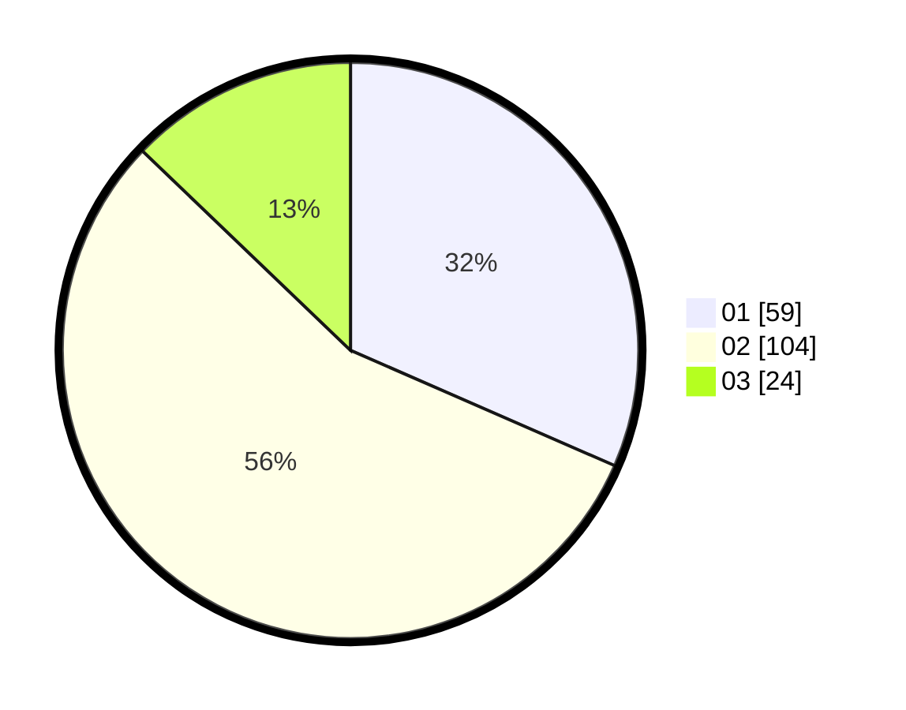

# Hasil

Hasil perolehan suara paslon dapat dilihat pada file paslon-01.txt, paslon-02.txt, dan paslon-03.txt.

Jika tidak ada, artinya data tersebut belum ada pada SIREKAP.

## Perolehan Suara

 * Paslon 01: **59**.
 * Paslon 02: **104**.
 * Paslon 03: **24**.

## Foto C Plano

https://sirekap-obj-formc.kpu.go.id/8912/pemilu/ppwp/31/73/01/10/01/3173011001067-20240214-192039--75768d2d-edcf-4952-ad01-3200ba1acddb.jpg

https://sirekap-obj-formc.kpu.go.id/8912/pemilu/ppwp/31/73/01/10/01/3173011001067-20240214-193812--877bf805-b6a7-4fa2-8ead-baf2c750cf31.jpg

https://sirekap-obj-formc.kpu.go.id/8912/pemilu/ppwp/31/73/01/10/01/3173011001067-20240214-195738--1ee8422a-5475-4de8-bdd9-dca05dc13640.jpg

## DATA PEMILIH TETAP

Jumlah pemilih dalam DPT: **228**.
 * L: **116**.
 * P: **112**.

## DATA PENGGUNA HAK PILIH

Jumlah pengguna hak pilih dalam DPT: **184**.
 * L: **91**.
 * P: **93**.

Jumlah pengguna hak pilih dalam DPTb: **3**.
 * L: **1**.
 * P: **2**.

Jumlah pengguna hak pilih dalam DPK: **1**.
 * L: **1**.
 * P: **0**.

Jumlah pengguna hak pilih: **188**.
 * L: **93**.
 * P: **95**.

## JUMLAH SUARA SAH DAN TIDAK SAH

JUMLAH SELURUH SUARA SAH: **187**.

JUMLAH SUARA TIDAK SAH: **1**.

JUMLAH SELURUH SUARA SAH DAN SUARA TIDAK SAH: **188**.
