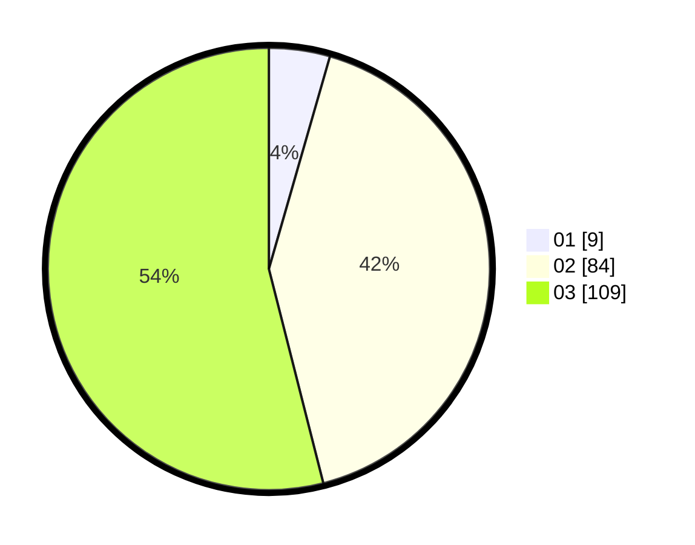

# Hasil

Hasil perolehan suara paslon dapat dilihat pada file paslon-01.txt, paslon-02.txt, dan paslon-03.txt.

Jika tidak ada, artinya data tersebut belum ada pada SIREKAP.

## Perolehan Suara

 * Paslon 01: **9**.
 * Paslon 02: **84**.
 * Paslon 03: **109**.

## Foto C Plano

https://sirekap-obj-formc.kpu.go.id/7b83/pemilu/ppwp/31/73/01/10/01/3173011001068-20240215-025143--8ec98215-2e2d-4948-96d4-5511569a09fa.jpg

https://sirekap-obj-formc.kpu.go.id/7b83/pemilu/ppwp/31/73/01/10/01/3173011001068-20240215-025246--bfea243d-d6bb-41a4-8275-129837038b1d.jpg

https://sirekap-obj-formc.kpu.go.id/7b83/pemilu/ppwp/31/73/01/10/01/3173011001068-20240215-025324--5c206ceb-213d-4fb4-87dc-97c7b3ef71f9.jpg
