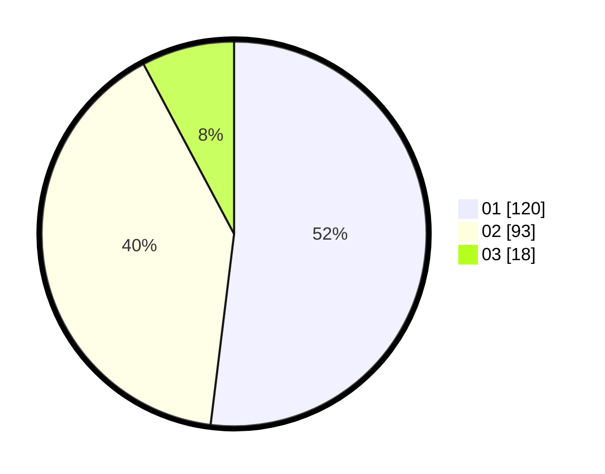

# Hasil

Hasil perolehan suara paslon dapat dilihat pada file paslon-01.txt, paslon-02.txt, dan paslon-03.txt.

Jika tidak ada, artinya data tersebut belum ada pada SIREKAP.

## Perolehan Suara

 * Paslon 01: **120**.
 * Paslon 02: **93**.
 * Paslon 03: **18**.

## Foto C Plano

https://sirekap-obj-formc.kpu.go.id/c407/pemilu/ppwp/31/73/01/10/01/3173011001074-20240214-160146--079d2015-156f-4958-bc43-b5a1395ce1ac.jpg

https://sirekap-obj-formc.kpu.go.id/c407/pemilu/ppwp/31/73/01/10/01/3173011001074-20240214-155730--87b50d9e-cf2a-4436-bdde-a106fc905399.jpg

https://sirekap-obj-formc.kpu.go.id/c407/pemilu/ppwp/31/73/01/10/01/3173011001074-20240214-155745--09060836-47b4-49c9-ac61-0fa9170cabda.jpg
