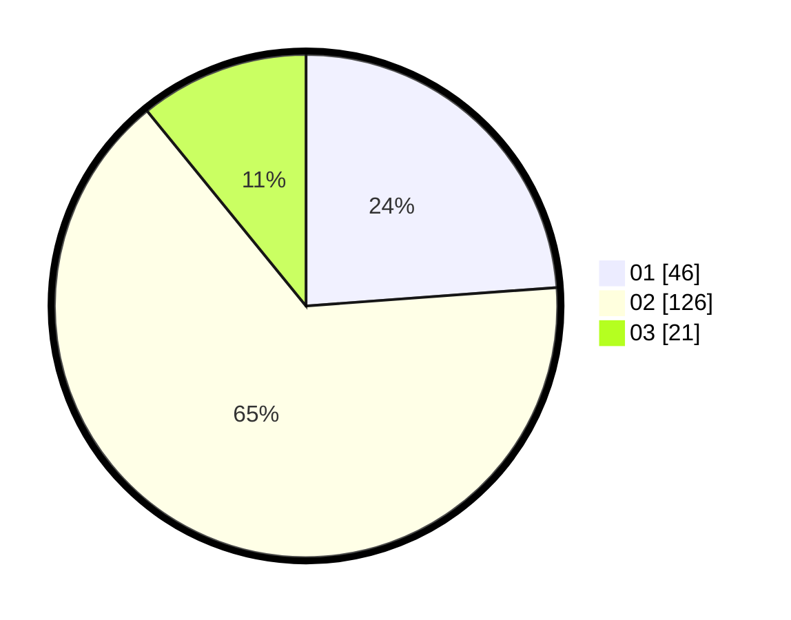

# Hasil

Hasil perolehan suara paslon dapat dilihat pada file paslon-01.txt, paslon-02.txt, dan paslon-03.txt.

Jika tidak ada, artinya data tersebut belum ada pada SIREKAP.

## Perolehan Suara

 * Paslon 01: **46**.
 * Paslon 02: **126**.
 * Paslon 03: **21**.

## Foto C Plano

https://sirekap-obj-formc.kpu.go.id/42b4/pemilu/ppwp/31/73/01/10/01/3173011001076-20240216-023915--96066e84-63b9-462d-8fb0-eb21c4c698d6.jpg

https://sirekap-obj-formc.kpu.go.id/42b4/pemilu/ppwp/31/73/01/10/01/3173011001076-20240214-194857--5e664297-4f86-47f0-8615-05fd9777854b.jpg

https://sirekap-obj-formc.kpu.go.id/42b4/pemilu/ppwp/31/73/01/10/01/3173011001076-20240216-023921--c2b3869f-ef1f-4104-847e-f4f0f8896021.jpg

## DATA PEMILIH TETAP

Jumlah pemilih dalam DPT: **248**.
 * L: **136**.
 * P: **112**.

## DATA PENGGUNA HAK PILIH

Jumlah pengguna hak pilih dalam DPT: **192**.
 * L: **101**.
 * P: **91**.

Jumlah pengguna hak pilih dalam DPTb: **0**.
 * L: **0**.
 * P: **0**.

Jumlah pengguna hak pilih dalam DPK: **4**.
 * L: **2**.
 * P: **2**.

Jumlah pengguna hak pilih: **196**.
 * L: **103**.
 * P: **93**.

## JUMLAH SUARA SAH DAN TIDAK SAH

JUMLAH SELURUH SUARA SAH: **193**.

JUMLAH SUARA TIDAK SAH: **3**.

JUMLAH SELURUH SUARA SAH DAN SUARA TIDAK SAH: **196**.
