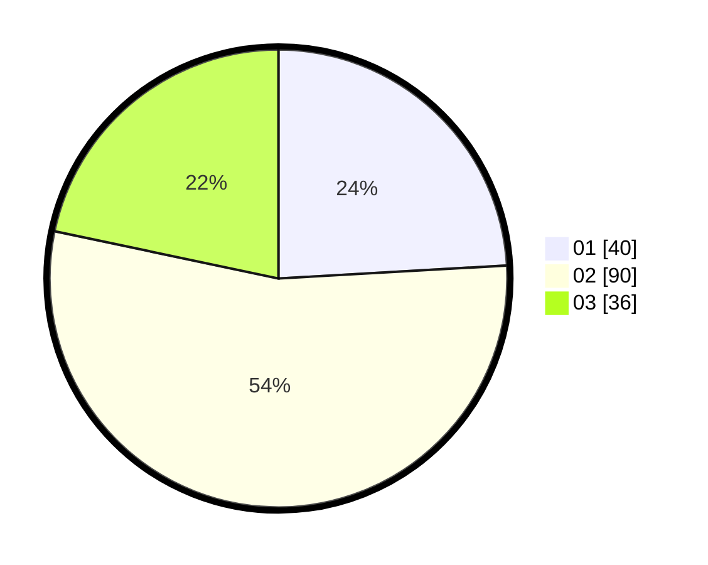

# Hasil

Hasil perolehan suara paslon dapat dilihat pada file paslon-01.txt, paslon-02.txt, dan paslon-03.txt.

Jika tidak ada, artinya data tersebut belum ada pada SIREKAP.

## Perolehan Suara

 * Paslon 01: **40**.
 * Paslon 02: **90**.
 * Paslon 03: **36**.

## Foto C Plano

https://sirekap-obj-formc.kpu.go.id/395d/pemilu/ppwp/31/73/01/10/01/3173011001077-20240214-230622--edcb2249-15b7-454c-aa16-8c5b79605a8a.jpg

https://sirekap-obj-formc.kpu.go.id/395d/pemilu/ppwp/31/73/01/10/01/3173011001077-20240215-002651--d8081835-37b9-4770-bd53-2b653f2ae8c8.jpg
