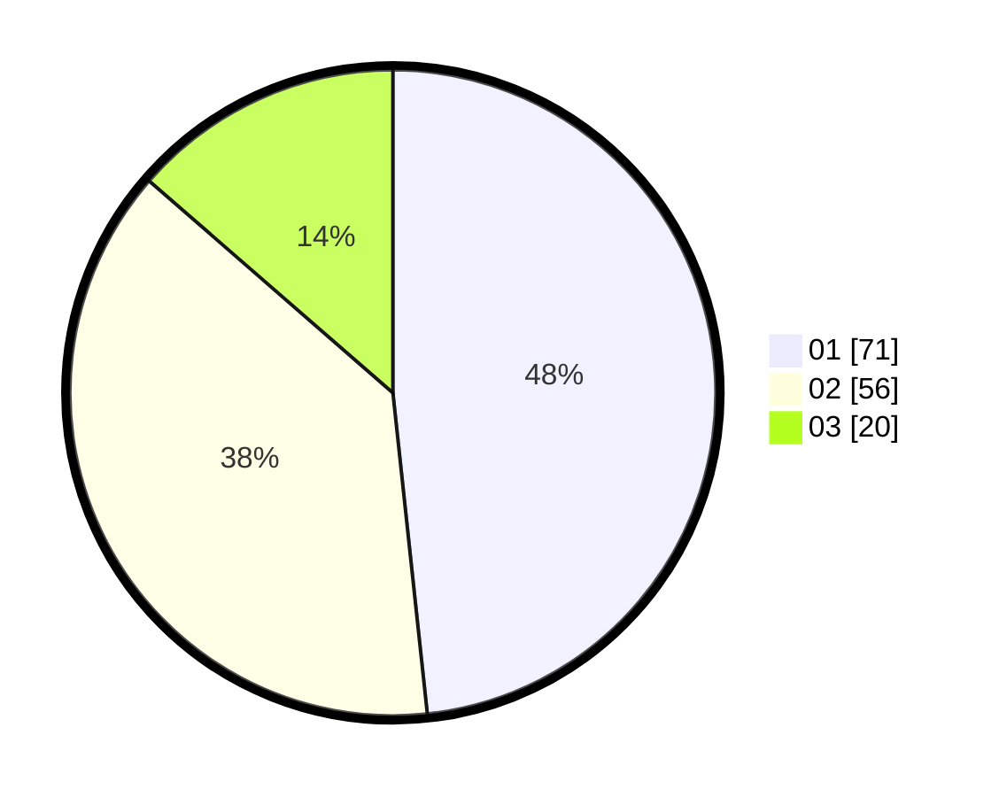

# Hasil

Hasil perolehan suara paslon dapat dilihat pada file paslon-01.txt, paslon-02.txt, dan paslon-03.txt.

Jika tidak ada, artinya data tersebut belum ada pada SIREKAP.

## Perolehan Suara

 * Paslon 01: **71**.
 * Paslon 02: **56**.
 * Paslon 03: **20**.

## Foto C Plano

https://sirekap-obj-formc.kpu.go.id/3974/pemilu/ppwp/31/73/01/10/01/3173011001079-20240214-194600--8241bce2-0784-45d1-a4ac-b68277f0cb70.jpg

https://sirekap-obj-formc.kpu.go.id/3974/pemilu/ppwp/31/73/01/10/01/3173011001079-20240214-194720--01db817b-b247-483a-8dd5-6c2a50b19c6e.jpg

https://sirekap-obj-formc.kpu.go.id/3974/pemilu/ppwp/31/73/01/10/01/3173011001079-20240214-194808--dede2edc-901e-4b76-b744-7336c1e7c440.jpg

## DATA PEMILIH TETAP

Jumlah pemilih dalam DPT: **215**.
 * L: **103**.
 * P: **112**.

## DATA PENGGUNA HAK PILIH

Jumlah pengguna hak pilih dalam DPT: **148**.
 * L: **62**.
 * P: **86**.

Jumlah pengguna hak pilih dalam DPTb: **0**.
 * L: **0**.
 * P: **0**.

Jumlah pengguna hak pilih dalam DPK: **0**.
 * L: **0**.
 * P: **0**.

Jumlah pengguna hak pilih: **148**.
 * L: **62**.
 * P: **86**.

## JUMLAH SUARA SAH DAN TIDAK SAH

JUMLAH SELURUH SUARA SAH: **147**.

JUMLAH SUARA TIDAK SAH: **1**.

JUMLAH SELURUH SUARA SAH DAN SUARA TIDAK SAH: **148**.
