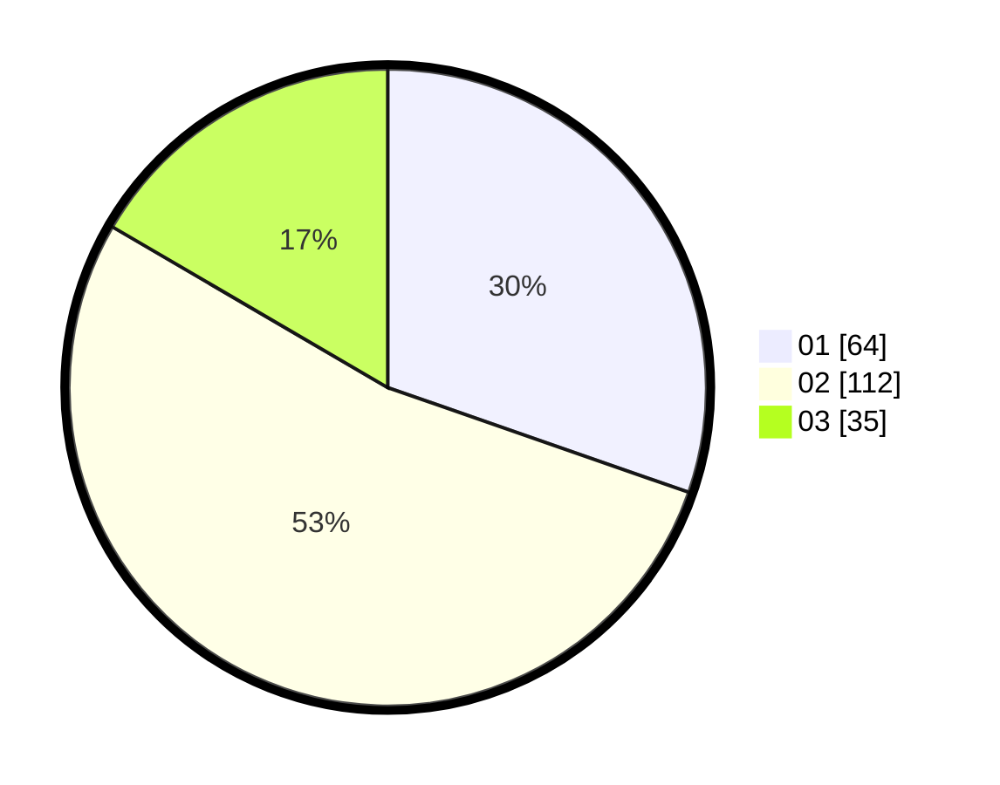

# Hasil

Hasil perolehan suara paslon dapat dilihat pada file paslon-01.txt, paslon-02.txt, dan paslon-03.txt.

Jika tidak ada, artinya data tersebut belum ada pada SIREKAP.

## Perolehan Suara

 * Paslon 01: **64**.
 * Paslon 02: **112**.
 * Paslon 03: **35**.

## Foto C Plano

https://sirekap-obj-formc.kpu.go.id/23f3/pemilu/ppwp/31/73/01/10/01/3173011001083-20240215-004805--1851164c-3c4c-4026-8277-7c59ab981859.jpg

https://sirekap-obj-formc.kpu.go.id/23f3/pemilu/ppwp/31/73/01/10/01/3173011001083-20240215-005347--daf6650e-47e5-4752-a9d4-9b5753fd37ec.jpg

https://sirekap-obj-formc.kpu.go.id/23f3/pemilu/ppwp/31/73/01/10/01/3173011001083-20240215-005525--4d54f167-1dcf-4384-9261-627ef2bfcd1f.jpg
