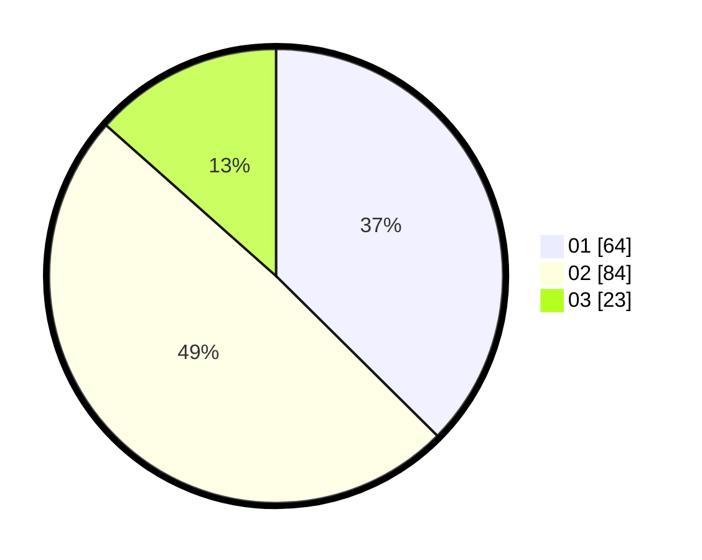

# Hasil

Hasil perolehan suara paslon dapat dilihat pada file paslon-01.txt, paslon-02.txt, dan paslon-03.txt.

Jika tidak ada, artinya data tersebut belum ada pada SIREKAP.

## Perolehan Suara

 * Paslon 01: **64**.
 * Paslon 02: **84**.
 * Paslon 03: **23**.

## Foto C Plano

https://sirekap-obj-formc.kpu.go.id/ac3c/pemilu/ppwp/31/73/01/10/01/3173011001087-20240214-233232--84f942f5-d094-4559-a2fa-eb9850c0f6f0.jpg

https://sirekap-obj-formc.kpu.go.id/ac3c/pemilu/ppwp/31/73/01/10/01/3173011001087-20240214-233149--bd937e3c-3748-47eb-8ace-87107020300f.jpg

https://sirekap-obj-formc.kpu.go.id/ac3c/pemilu/ppwp/31/73/01/10/01/3173011001087-20240214-233046--46012d4e-f240-4554-b78e-68cf5076b214.jpg
