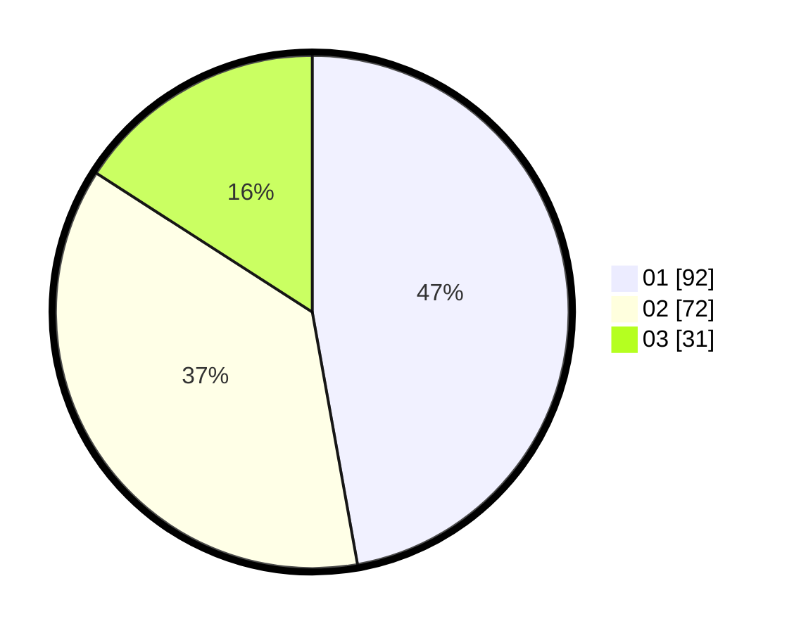

# Hasil

Hasil perolehan suara paslon dapat dilihat pada file paslon-01.txt, paslon-02.txt, dan paslon-03.txt.

Jika tidak ada, artinya data tersebut belum ada pada SIREKAP.

## Perolehan Suara

 * Paslon 01: **92**.
 * Paslon 02: **72**.
 * Paslon 03: **31**.

## Foto C Plano

https://sirekap-obj-formc.kpu.go.id/1143/pemilu/ppwp/31/73/01/10/01/3173011001088-20240214-214124--1709e24d-a259-4cde-abb8-ff9613c0e78c.jpg

https://sirekap-obj-formc.kpu.go.id/1143/pemilu/ppwp/31/73/01/10/01/3173011001088-20240214-214221--0711080b-55a2-4f17-91af-54b354bf2daf.jpg

https://sirekap-obj-formc.kpu.go.id/1143/pemilu/ppwp/31/73/01/10/01/3173011001088-20240214-214636--4e6eccf6-145c-4d23-a7bd-85e56989c4b9.jpg
