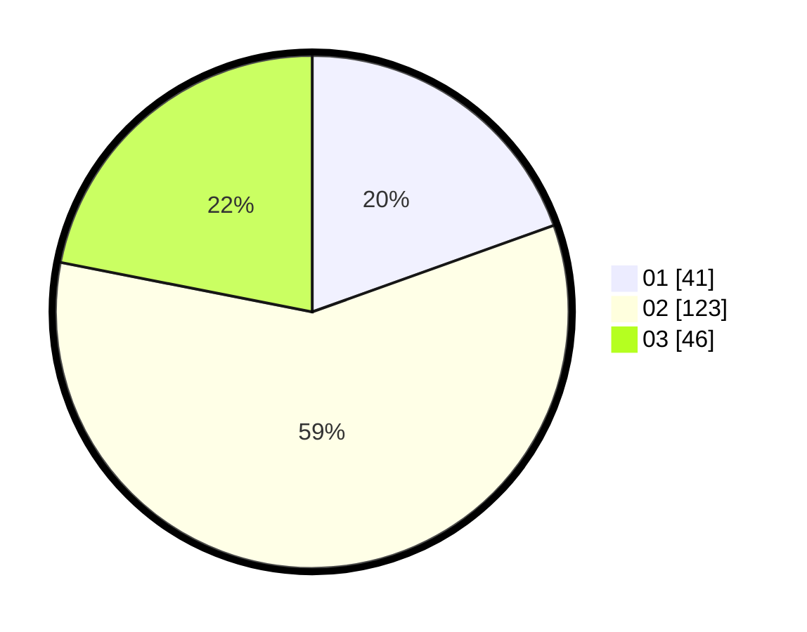

# Hasil

Hasil perolehan suara paslon dapat dilihat pada file paslon-01.txt, paslon-02.txt, dan paslon-03.txt.

Jika tidak ada, artinya data tersebut belum ada pada SIREKAP.

## Perolehan Suara

 * Paslon 01: **41**.
 * Paslon 02: **123**.
 * Paslon 03: **46**.

## Foto C Plano

https://sirekap-obj-formc.kpu.go.id/2bf5/pemilu/ppwp/31/73/01/10/01/3173011001089-20240214-232057--fd2e9099-5459-4112-b0ee-90ec42dbd96b.jpg

https://sirekap-obj-formc.kpu.go.id/2bf5/pemilu/ppwp/31/73/01/10/01/3173011001089-20240215-092021--277311af-e6d9-43ca-adbd-538dd3fba34b.jpg

https://sirekap-obj-formc.kpu.go.id/2bf5/pemilu/ppwp/31/73/01/10/01/3173011001089-20240214-232349--36935c42-81c1-4355-af88-3c34281d4e75.jpg
