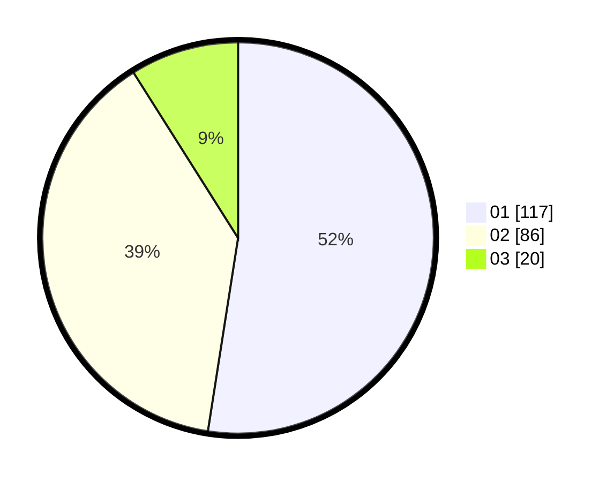

# Hasil

Hasil perolehan suara paslon dapat dilihat pada file paslon-01.txt, paslon-02.txt, dan paslon-03.txt.

Jika tidak ada, artinya data tersebut belum ada pada SIREKAP.

## Perolehan Suara

 * Paslon 01: **117**.
 * Paslon 02: **86**.
 * Paslon 03: **20**.

## Foto C Plano

https://sirekap-obj-formc.kpu.go.id/22cd/pemilu/ppwp/31/73/01/10/01/3173011001094-20240214-231525--87c7b084-6edb-4654-b341-a784f4d7a1dc.jpg

https://sirekap-obj-formc.kpu.go.id/22cd/pemilu/ppwp/31/73/01/10/01/3173011001094-20240214-203951--e7acac0c-e151-4c33-bf77-3a58f538b276.jpg

https://sirekap-obj-formc.kpu.go.id/22cd/pemilu/ppwp/31/73/01/10/01/3173011001094-20240214-231752--59e090bf-7e18-4048-a60e-e3c6a4016f60.jpg
