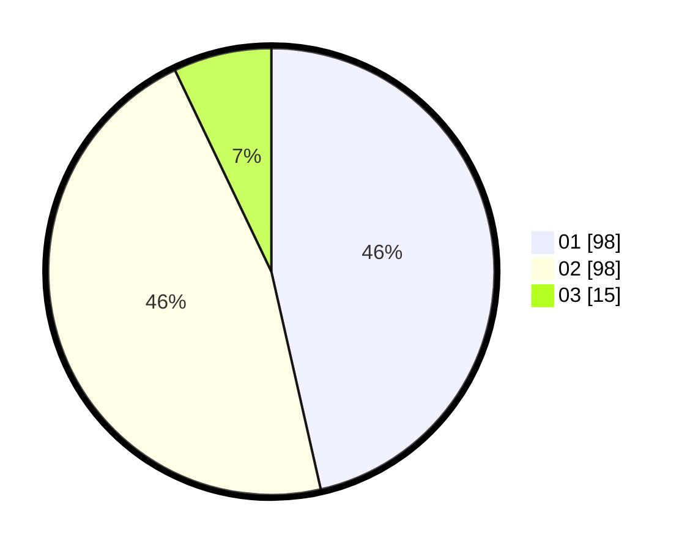

# Hasil

Hasil perolehan suara paslon dapat dilihat pada file paslon-01.txt, paslon-02.txt, dan paslon-03.txt.

Jika tidak ada, artinya data tersebut belum ada pada SIREKAP.

## Perolehan Suara

 * Paslon 01: **98**.
 * Paslon 02: **98**.
 * Paslon 03: **15**.

## Foto C Plano

https://sirekap-obj-formc.kpu.go.id/97a6/pemilu/ppwp/31/73/01/10/01/3173011001095-20240214-141309--88d67ba6-b367-4894-a959-a1af8c3e99cf.jpg

https://sirekap-obj-formc.kpu.go.id/97a6/pemilu/ppwp/31/73/01/10/01/3173011001095-20240214-141440--aac8a5fb-1742-4ce4-bc22-704025b0363a.jpg

https://sirekap-obj-formc.kpu.go.id/97a6/pemilu/ppwp/31/73/01/10/01/3173011001095-20240214-141657--bbacc2cd-c37d-4e79-ad5e-97e1f637b743.jpg
