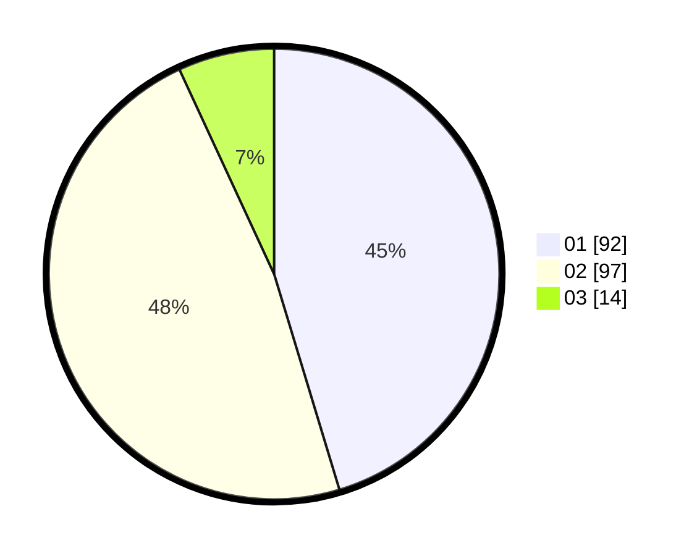

# Hasil

Hasil perolehan suara paslon dapat dilihat pada file paslon-01.txt, paslon-02.txt, dan paslon-03.txt.

Jika tidak ada, artinya data tersebut belum ada pada SIREKAP.

## Perolehan Suara

 * Paslon 01: **92**.
 * Paslon 02: **97**.
 * Paslon 03: **14**.

## Foto C Plano

https://sirekap-obj-formc.kpu.go.id/50fd/pemilu/ppwp/31/73/01/10/01/3173011001097-20240215-024318--c15967b3-8cf1-403b-a0c4-e5568769d5d0.jpg

https://sirekap-obj-formc.kpu.go.id/50fd/pemilu/ppwp/31/73/01/10/01/3173011001097-20240214-233626--bada8a90-ac9d-48f0-8ad1-6f9edcdc2021.jpg

https://sirekap-obj-formc.kpu.go.id/50fd/pemilu/ppwp/31/73/01/10/01/3173011001097-20240214-233748--8ba997fc-d302-4864-aadd-52b8d6b3dff8.jpg
