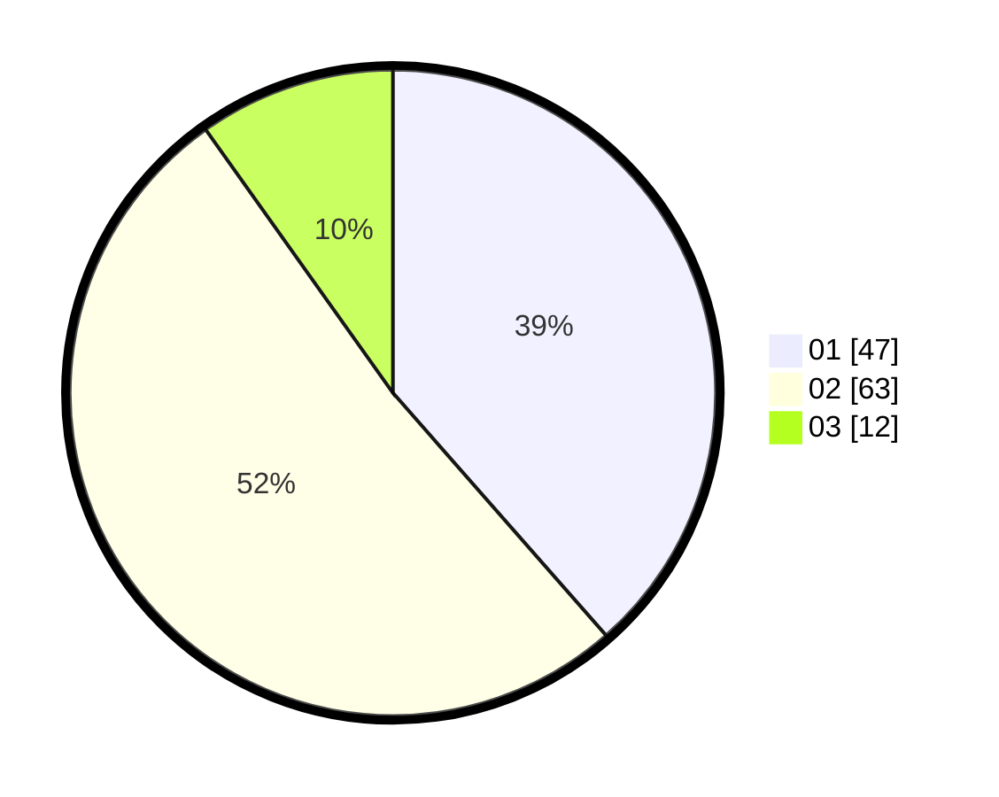

# Hasil

Hasil perolehan suara paslon dapat dilihat pada file paslon-01.txt, paslon-02.txt, dan paslon-03.txt.

Jika tidak ada, artinya data tersebut belum ada pada SIREKAP.

## Perolehan Suara

 * Paslon 01: **47**.
 * Paslon 02: **63**.
 * Paslon 03: **12**.

## Foto C Plano

https://sirekap-obj-formc.kpu.go.id/88de/pemilu/ppwp/31/73/01/10/01/3173011001098-20240214-215830--fe283b0a-763f-417a-8e31-c84d3531502d.jpg

https://sirekap-obj-formc.kpu.go.id/88de/pemilu/ppwp/31/73/01/10/01/3173011001098-20240214-220500--cf8cf435-61d1-41aa-9d7d-74ead45e62e4.jpg

https://sirekap-obj-formc.kpu.go.id/88de/pemilu/ppwp/31/73/01/10/01/3173011001098-20240214-211724--c543ea1a-3bfc-4735-ad35-51127afd2c8e.jpg
