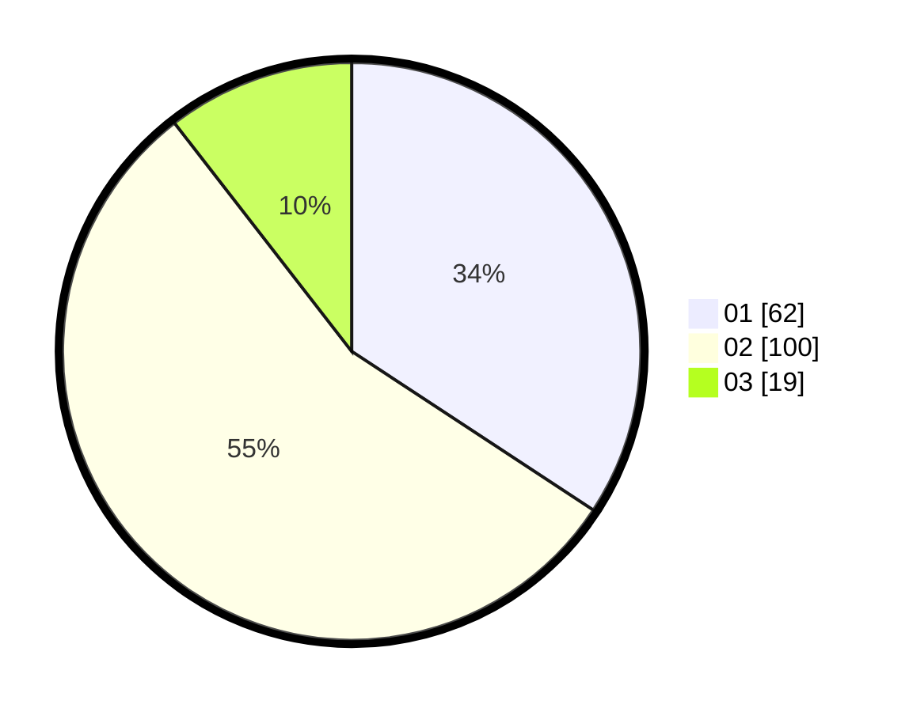

# Hasil

Hasil perolehan suara paslon dapat dilihat pada file paslon-01.txt, paslon-02.txt, dan paslon-03.txt.

Jika tidak ada, artinya data tersebut belum ada pada SIREKAP.

## Perolehan Suara

 * Paslon 01: **62**.
 * Paslon 02: **100**.
 * Paslon 03: **19**.

## Foto C Plano

https://sirekap-obj-formc.kpu.go.id/8c73/pemilu/ppwp/31/73/01/10/01/3173011001099-20240214-222340--12e91b15-e98d-41bd-9edd-98d435185453.jpg

https://sirekap-obj-formc.kpu.go.id/8c73/pemilu/ppwp/31/73/01/10/01/3173011001099-20240214-212754--3d4462e4-f371-4630-a825-eb486f477266.jpg

https://sirekap-obj-formc.kpu.go.id/8c73/pemilu/ppwp/31/73/01/10/01/3173011001099-20240214-212634--4b64ccf1-9bc0-4860-8aee-b4fd18ea3853.jpg
