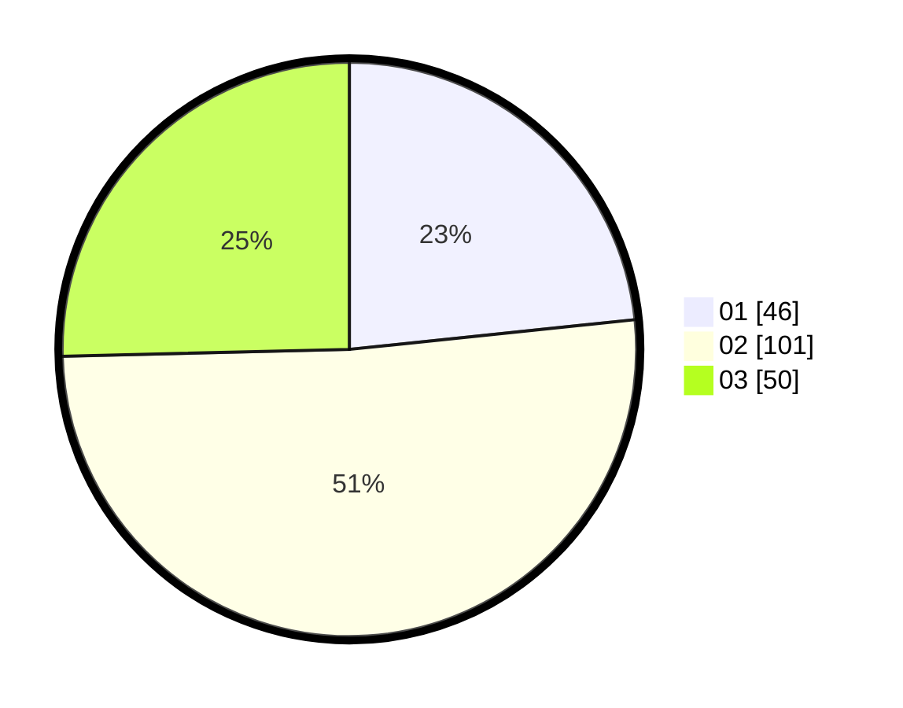

# Hasil

Hasil perolehan suara paslon dapat dilihat pada file paslon-01.txt, paslon-02.txt, dan paslon-03.txt.

Jika tidak ada, artinya data tersebut belum ada pada SIREKAP.

## Perolehan Suara

 * Paslon 01: **46**.
 * Paslon 02: **101**.
 * Paslon 03: **50**.

## Foto C Plano

https://sirekap-obj-formc.kpu.go.id/a8d1/pemilu/ppwp/31/73/01/10/01/3173011001110-20240216-021455--240a4133-3a06-4088-8671-934b8c409a6d.jpg

https://sirekap-obj-formc.kpu.go.id/a8d1/pemilu/ppwp/31/73/01/10/01/3173011001110-20240216-021514--d428fd8b-e86e-4917-84de-1708432bc25f.jpg

https://sirekap-obj-formc.kpu.go.id/a8d1/pemilu/ppwp/31/73/01/10/01/3173011001110-20240216-021504--7cc5ac01-4f31-40a3-afb7-89f814ab59dd.jpg

## DATA PEMILIH TETAP

Jumlah pemilih dalam DPT: **259**.
 * L: **121**.
 * P: **138**.

## DATA PENGGUNA HAK PILIH

Jumlah pengguna hak pilih dalam DPT: **184**.
 * L: **89**.
 * P: **95**.

Jumlah pengguna hak pilih dalam DPTb: **15**.
 * L: **9**.
 * P: **6**.

Jumlah pengguna hak pilih dalam DPK: **5**.
 * L: **1**.
 * P: **4**.

Jumlah pengguna hak pilih: **204**.
 * L: **99**.
 * P: **107**.

## JUMLAH SUARA SAH DAN TIDAK SAH

JUMLAH SELURUH SUARA SAH: **197**.

JUMLAH SUARA TIDAK SAH: **7**.

JUMLAH SELURUH SUARA SAH DAN SUARA TIDAK SAH: **204**.
