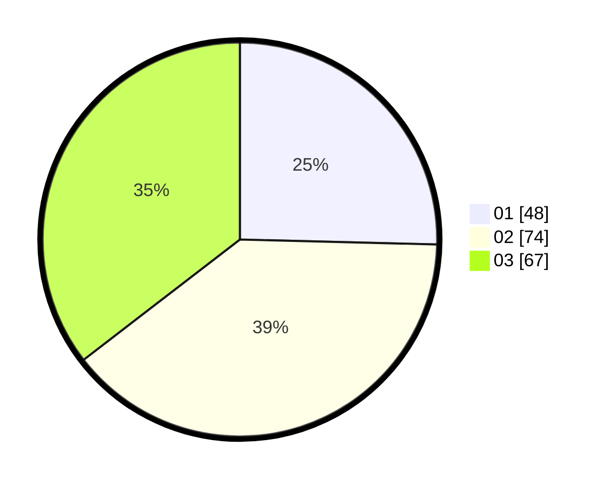

# Hasil

Hasil perolehan suara paslon dapat dilihat pada file paslon-01.txt, paslon-02.txt, dan paslon-03.txt.

Jika tidak ada, artinya data tersebut belum ada pada SIREKAP.

## Perolehan Suara

 * Paslon 01: **48**.
 * Paslon 02: **74**.
 * Paslon 03: **67**.

## Foto C Plano

https://sirekap-obj-formc.kpu.go.id/012f/pemilu/ppwp/31/73/01/10/01/3173011001111-20240215-043406--46ca45e1-e768-4c23-b27e-ca4303b4a1fb.jpg

https://sirekap-obj-formc.kpu.go.id/012f/pemilu/ppwp/31/73/01/10/01/3173011001111-20240215-043525--fe25cb32-efff-4b73-8041-efafe9470620.jpg

https://sirekap-obj-formc.kpu.go.id/012f/pemilu/ppwp/31/73/01/10/01/3173011001111-20240215-043624--2bd6d121-2523-43e6-a6e5-3ce89437848c.jpg
