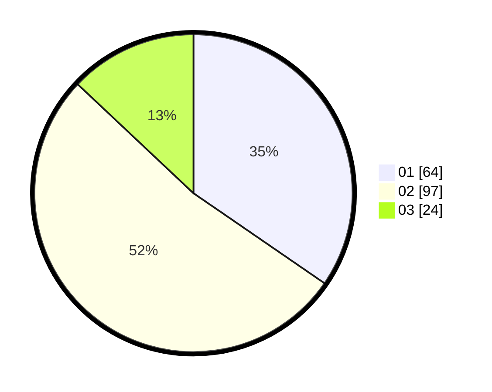

# Hasil

Hasil perolehan suara paslon dapat dilihat pada file paslon-01.txt, paslon-02.txt, dan paslon-03.txt.

Jika tidak ada, artinya data tersebut belum ada pada SIREKAP.

## Perolehan Suara

 * Paslon 01: **64**.
 * Paslon 02: **97**.
 * Paslon 03: **24**.

## Foto C Plano

https://sirekap-obj-formc.kpu.go.id/bda5/pemilu/ppwp/31/73/01/10/01/3173011001113-20240215-000002--e35ea831-f6fe-4731-a9ac-2dc568cdc9f9.jpg

https://sirekap-obj-formc.kpu.go.id/bda5/pemilu/ppwp/31/73/01/10/01/3173011001113-20240215-000235--a1da8664-9980-4c6e-b2c2-6f29f027747e.jpg

https://sirekap-obj-formc.kpu.go.id/bda5/pemilu/ppwp/31/73/01/10/01/3173011001113-20240215-000458--71fe0eea-372e-4c67-903a-2a3c6a8d50ec.jpg
