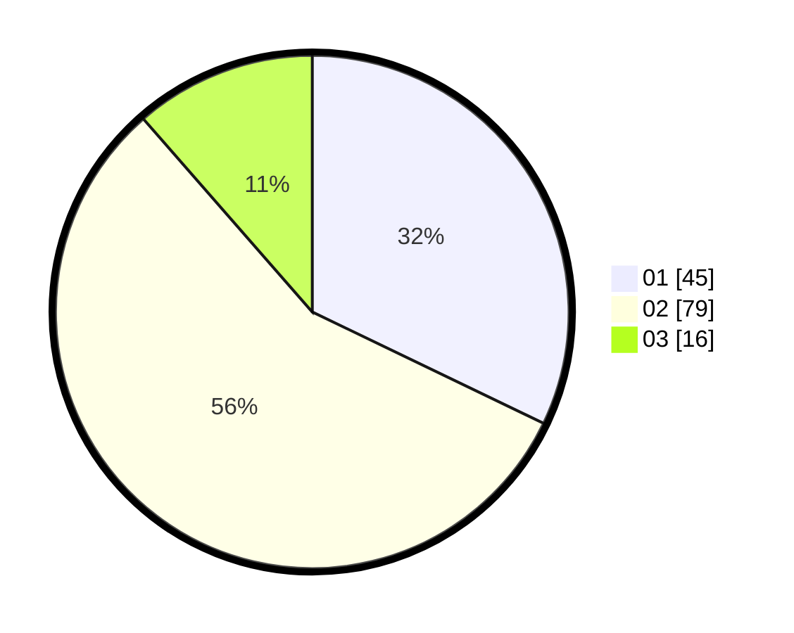

# Hasil

Hasil perolehan suara paslon dapat dilihat pada file paslon-01.txt, paslon-02.txt, dan paslon-03.txt.

Jika tidak ada, artinya data tersebut belum ada pada SIREKAP.

## Perolehan Suara

 * Paslon 01: **45**.
 * Paslon 02: **79**.
 * Paslon 03: **16**.

## Foto C Plano

https://sirekap-obj-formc.kpu.go.id/d7d8/pemilu/ppwp/31/73/01/10/01/3173011001114-20240214-205325--aa8c3bb2-ad7a-4d3f-ac57-78d346a77e4e.jpg

https://sirekap-obj-formc.kpu.go.id/d7d8/pemilu/ppwp/31/73/01/10/01/3173011001114-20240214-205541--432bb2df-fc97-4978-a10f-6201d336fba2.jpg

https://sirekap-obj-formc.kpu.go.id/d7d8/pemilu/ppwp/31/73/01/10/01/3173011001114-20240214-205804--2401a89c-ab57-4a83-bb97-4c5d82b6d58b.jpg

## DATA PEMILIH TETAP

Jumlah pemilih dalam DPT: **228**.
 * L: **123**.
 * P: **105**.

## DATA PENGGUNA HAK PILIH

Jumlah pengguna hak pilih dalam DPT: **135**.
 * L: **65**.
 * P: **70**.

Jumlah pengguna hak pilih dalam DPTb: **0**.
 * L: **0**.
 * P: **0**.

Jumlah pengguna hak pilih dalam DPK: **7**.
 * L: **3**.
 * P: **4**.

Jumlah pengguna hak pilih: **142**.
 * L: **68**.
 * P: **74**.

## JUMLAH SUARA SAH DAN TIDAK SAH

JUMLAH SELURUH SUARA SAH: **140**.

JUMLAH SUARA TIDAK SAH: **2**.

JUMLAH SELURUH SUARA SAH DAN SUARA TIDAK SAH: **142**.
