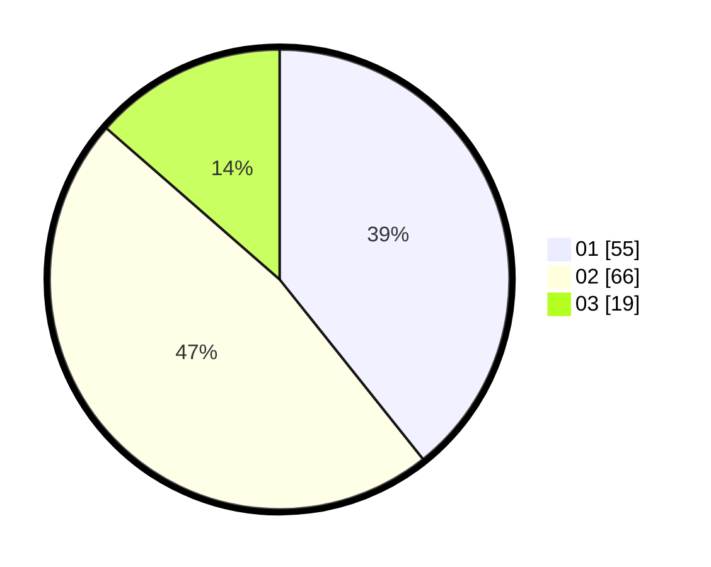

# Hasil

Hasil perolehan suara paslon dapat dilihat pada file paslon-01.txt, paslon-02.txt, dan paslon-03.txt.

Jika tidak ada, artinya data tersebut belum ada pada SIREKAP.

## Perolehan Suara

 * Paslon 01: **55**.
 * Paslon 02: **66**.
 * Paslon 03: **19**.

## Foto C Plano

https://sirekap-obj-formc.kpu.go.id/c255/pemilu/ppwp/31/73/01/10/01/3173011001116-20240214-231234--4cc3322a-157e-412f-abf4-0a1e811508ba.jpg

https://sirekap-obj-formc.kpu.go.id/c255/pemilu/ppwp/31/73/01/10/01/3173011001116-20240214-231427--fdbf3793-655f-4ac2-9de8-2332955470b9.jpg

https://sirekap-obj-formc.kpu.go.id/c255/pemilu/ppwp/31/73/01/10/01/3173011001116-20240214-231519--d7b6b036-0037-4b92-a334-7602b48e0424.jpg
