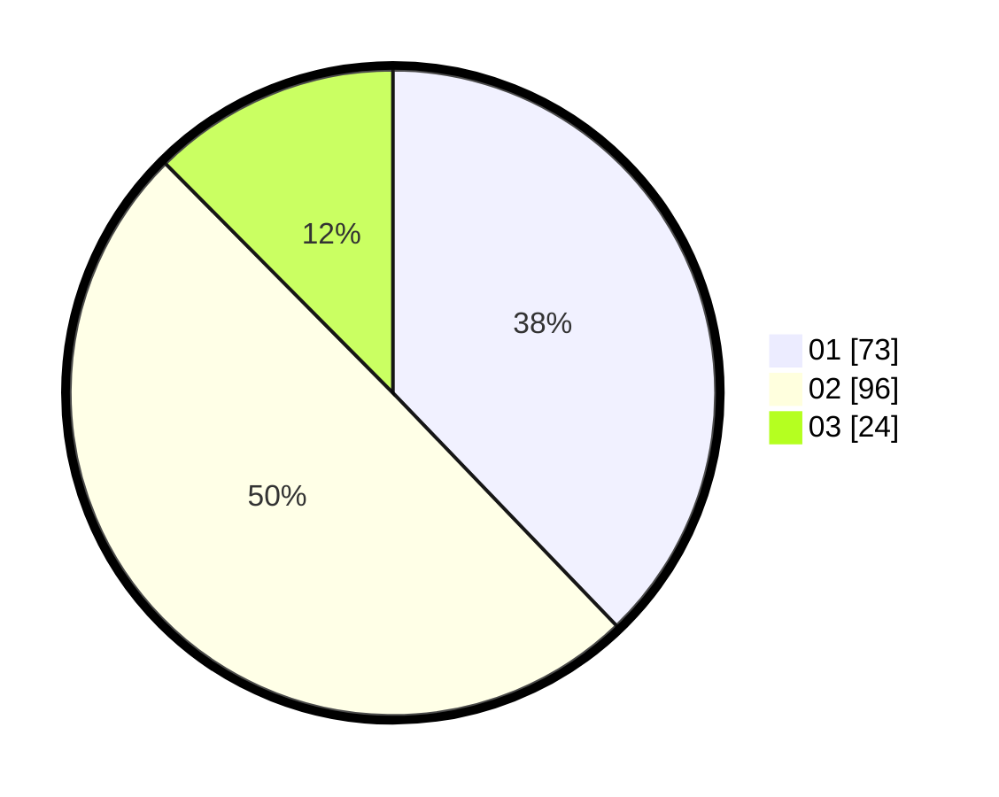

# Hasil

Hasil perolehan suara paslon dapat dilihat pada file paslon-01.txt, paslon-02.txt, dan paslon-03.txt.

Jika tidak ada, artinya data tersebut belum ada pada SIREKAP.

## Perolehan Suara

 * Paslon 01: **73**.
 * Paslon 02: **96**.
 * Paslon 03: **24**.

## Foto C Plano

https://sirekap-obj-formc.kpu.go.id/972a/pemilu/ppwp/31/73/01/10/01/3173011001120-20240214-215826--ee9142a0-5a68-4b28-aa76-53e4c8024a98.jpg

https://sirekap-obj-formc.kpu.go.id/972a/pemilu/ppwp/31/73/01/10/01/3173011001120-20240214-215937--d3d56f70-32e8-4838-9898-6b0969f32e7b.jpg

https://sirekap-obj-formc.kpu.go.id/972a/pemilu/ppwp/31/73/01/10/01/3173011001120-20240214-220031--e577b23f-d48d-4e02-9ec3-ed6929f28c60.jpg

## DATA PEMILIH TETAP

Jumlah pemilih dalam DPT: **255**.
 * L: **137**.
 * P: **118**.

## DATA PENGGUNA HAK PILIH

Jumlah pengguna hak pilih dalam DPT: **193**.
 * L: **98**.
 * P: **95**.

Jumlah pengguna hak pilih dalam DPTb: **0**.
 * L: **0**.
 * P: **0**.

Jumlah pengguna hak pilih dalam DPK: **2**.
 * L: **0**.
 * P: **2**.

Jumlah pengguna hak pilih: **195**.
 * L: **98**.
 * P: **97**.

## JUMLAH SUARA SAH DAN TIDAK SAH

JUMLAH SELURUH SUARA SAH: **193**.

JUMLAH SUARA TIDAK SAH: **2**.

JUMLAH SELURUH SUARA SAH DAN SUARA TIDAK SAH: **195**.
