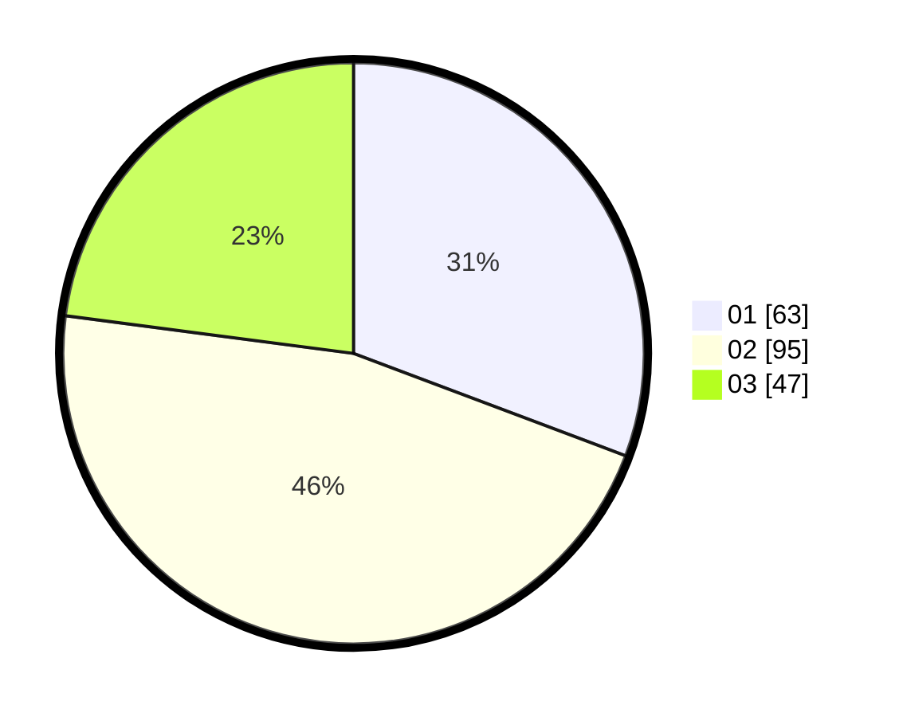

# Hasil

Hasil perolehan suara paslon dapat dilihat pada file paslon-01.txt, paslon-02.txt, dan paslon-03.txt.

Jika tidak ada, artinya data tersebut belum ada pada SIREKAP.

## Perolehan Suara

 * Paslon 01: **63**.
 * Paslon 02: **95**.
 * Paslon 03: **47**.

## Foto C Plano

https://sirekap-obj-formc.kpu.go.id/1ab9/pemilu/ppwp/31/73/01/10/01/3173011001122-20240214-190147--e677f641-b110-4897-a5a6-eb78888ec790.jpg

https://sirekap-obj-formc.kpu.go.id/1ab9/pemilu/ppwp/31/73/01/10/01/3173011001122-20240214-190138--8b3240a4-59d9-4e23-9936-7518710b18ec.jpg

https://sirekap-obj-formc.kpu.go.id/1ab9/pemilu/ppwp/31/73/01/10/01/3173011001122-20240214-190201--8abacbb9-cd3f-47dc-a1cf-ea3b02e17caf.jpg

## DATA PEMILIH TETAP

Jumlah pemilih dalam DPT: **279**.
 * L: **145**.
 * P: **134**.

## DATA PENGGUNA HAK PILIH

Jumlah pengguna hak pilih dalam DPT: **204**.
 * L: **103**.
 * P: **101**.

Jumlah pengguna hak pilih dalam DPTb: **0**.
 * L: **0**.
 * P: **0**.

Jumlah pengguna hak pilih dalam DPK: **5**.
 * L: **4**.
 * P: **1**.

Jumlah pengguna hak pilih: **209**.
 * L: **107**.
 * P: **102**.

## JUMLAH SUARA SAH DAN TIDAK SAH

JUMLAH SELURUH SUARA SAH: **205**.

JUMLAH SUARA TIDAK SAH: **4**.

JUMLAH SELURUH SUARA SAH DAN SUARA TIDAK SAH: **209**.
