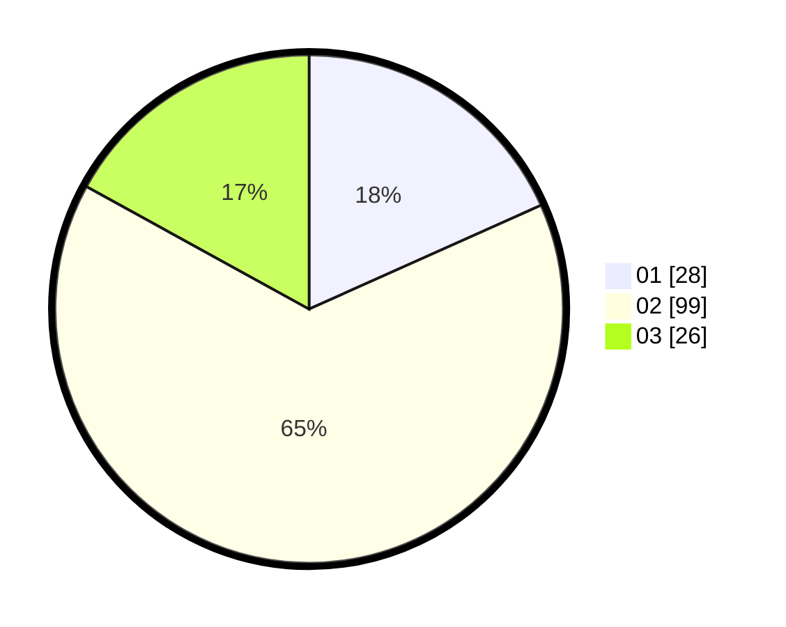

# Hasil

Hasil perolehan suara paslon dapat dilihat pada file paslon-01.txt, paslon-02.txt, dan paslon-03.txt.

Jika tidak ada, artinya data tersebut belum ada pada SIREKAP.

## Perolehan Suara

 * Paslon 01: **28**.
 * Paslon 02: **99**.
 * Paslon 03: **26**.

## Foto C Plano

https://sirekap-obj-formc.kpu.go.id/1eb0/pemilu/ppwp/31/73/01/10/01/3173011001127-20240214-230733--c52c9a8b-0ca3-4aca-b1ad-1f7a7cb637ef.jpg

https://sirekap-obj-formc.kpu.go.id/1eb0/pemilu/ppwp/31/73/01/10/01/3173011001127-20240216-192552--767e61b3-eebc-4b06-8afe-6a223796e9ed.jpg

https://sirekap-obj-formc.kpu.go.id/1eb0/pemilu/ppwp/31/73/01/10/01/3173011001127-20240214-230820--e61ee6a0-8aeb-4c57-9b39-7780c50343cc.jpg
