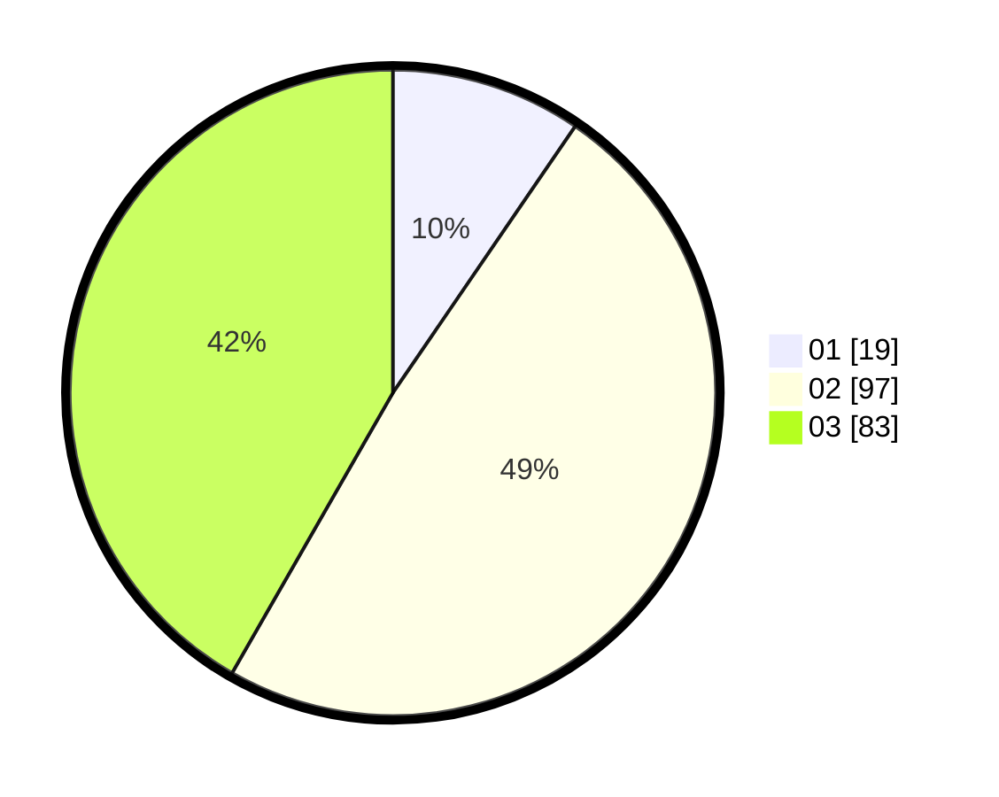

# Hasil

Hasil perolehan suara paslon dapat dilihat pada file paslon-01.txt, paslon-02.txt, dan paslon-03.txt.

Jika tidak ada, artinya data tersebut belum ada pada SIREKAP.

## Perolehan Suara

 * Paslon 01: **19**.
 * Paslon 02: **97**.
 * Paslon 03: **83**.

## Foto C Plano

https://sirekap-obj-formc.kpu.go.id/5234/pemilu/ppwp/31/73/01/10/01/3173011001128-20240214-214114--d0a609d5-9a56-4215-910c-e5ab984b9a42.jpg

https://sirekap-obj-formc.kpu.go.id/5234/pemilu/ppwp/31/73/01/10/01/3173011001128-20240214-214636--61b0f602-4e33-4f49-a65d-5678ab91459c.jpg

https://sirekap-obj-formc.kpu.go.id/5234/pemilu/ppwp/31/73/01/10/01/3173011001128-20240214-214906--e1cf6801-d4bd-49ec-b930-01460503410f.jpg
