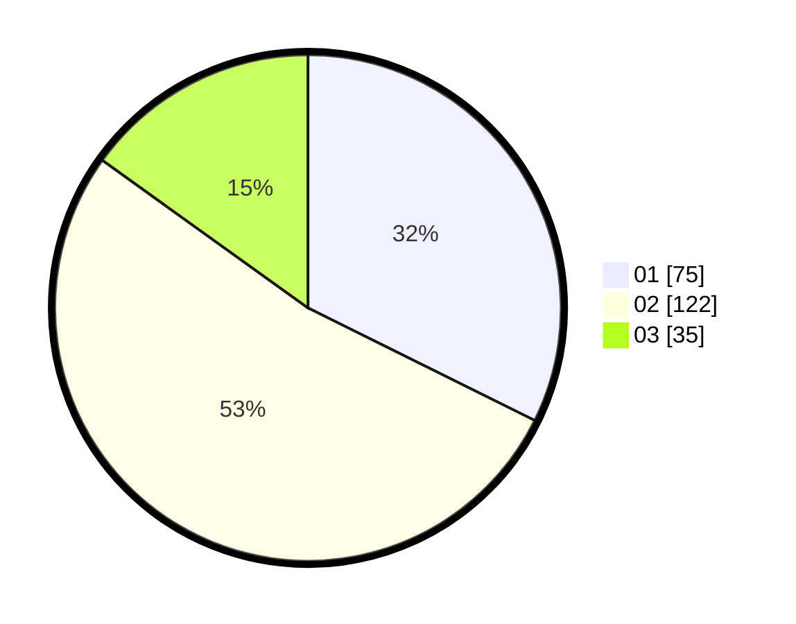

# Hasil

Hasil perolehan suara paslon dapat dilihat pada file paslon-01.txt, paslon-02.txt, dan paslon-03.txt.

Jika tidak ada, artinya data tersebut belum ada pada SIREKAP.

## Perolehan Suara

 * Paslon 01: **75**.
 * Paslon 02: **122**.
 * Paslon 03: **35**.

## Foto C Plano

https://sirekap-obj-formc.kpu.go.id/fc9b/pemilu/ppwp/31/73/01/10/01/3173011001130-20240214-221235--16b88ec8-dbc1-4c96-a235-53ab858e75ec.jpg

https://sirekap-obj-formc.kpu.go.id/fc9b/pemilu/ppwp/31/73/01/10/01/3173011001130-20240214-221307--5d14b086-3bb6-4e71-8bff-e9e01573ebf0.jpg

https://sirekap-obj-formc.kpu.go.id/fc9b/pemilu/ppwp/31/73/01/10/01/3173011001130-20240214-221408--a13aa538-af33-4485-972e-3297622e16d0.jpg

## DATA PEMILIH TETAP

Jumlah pemilih dalam DPT: **284**.
 * L: **139**.
 * P: **145**.

## DATA PENGGUNA HAK PILIH

Jumlah pengguna hak pilih dalam DPT: **230**.
 * L: **111**.
 * P: **119**.

Jumlah pengguna hak pilih dalam DPTb: **0**.
 * L: **0**.
 * P: **0**.

Jumlah pengguna hak pilih dalam DPK: **7**.
 * L: **5**.
 * P: **2**.

Jumlah pengguna hak pilih: **237**.
 * L: **116**.
 * P: **121**.

## JUMLAH SUARA SAH DAN TIDAK SAH

JUMLAH SELURUH SUARA SAH: **232**.

JUMLAH SUARA TIDAK SAH: **5**.

JUMLAH SELURUH SUARA SAH DAN SUARA TIDAK SAH: **237**.
