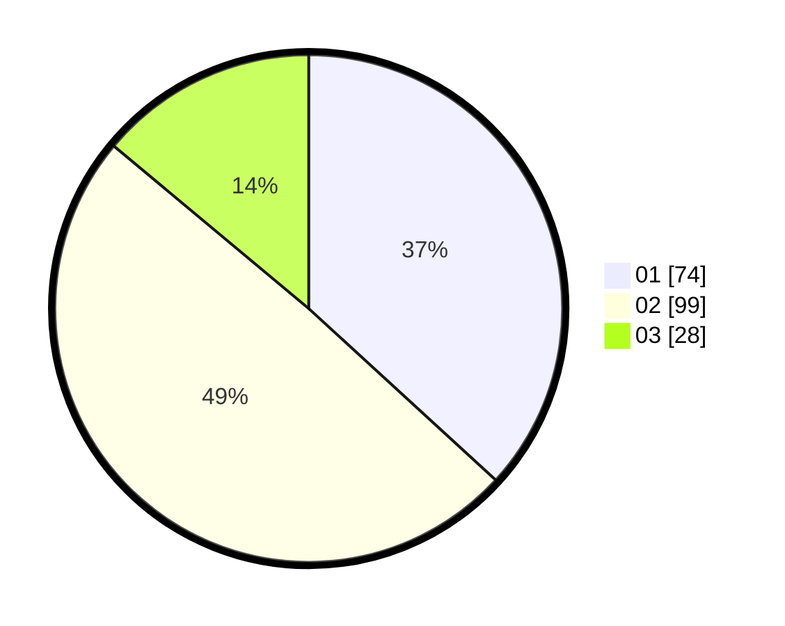

# Hasil

Hasil perolehan suara paslon dapat dilihat pada file paslon-01.txt, paslon-02.txt, dan paslon-03.txt.

Jika tidak ada, artinya data tersebut belum ada pada SIREKAP.

## Perolehan Suara

 * Paslon 01: **74**.
 * Paslon 02: **99**.
 * Paslon 03: **28**.

## Foto C Plano

https://sirekap-obj-formc.kpu.go.id/a5d7/pemilu/ppwp/31/73/01/10/01/3173011001131-20240215-014009--c1f6a043-f1c9-4730-af97-61078a5feac7.jpg

https://sirekap-obj-formc.kpu.go.id/a5d7/pemilu/ppwp/31/73/01/10/01/3173011001131-20240215-014047--edbaac66-34cf-436a-a439-b70204339a96.jpg

https://sirekap-obj-formc.kpu.go.id/a5d7/pemilu/ppwp/31/73/01/10/01/3173011001131-20240215-014217--26670989-abab-480f-ab74-f61cedc9039c.jpg
