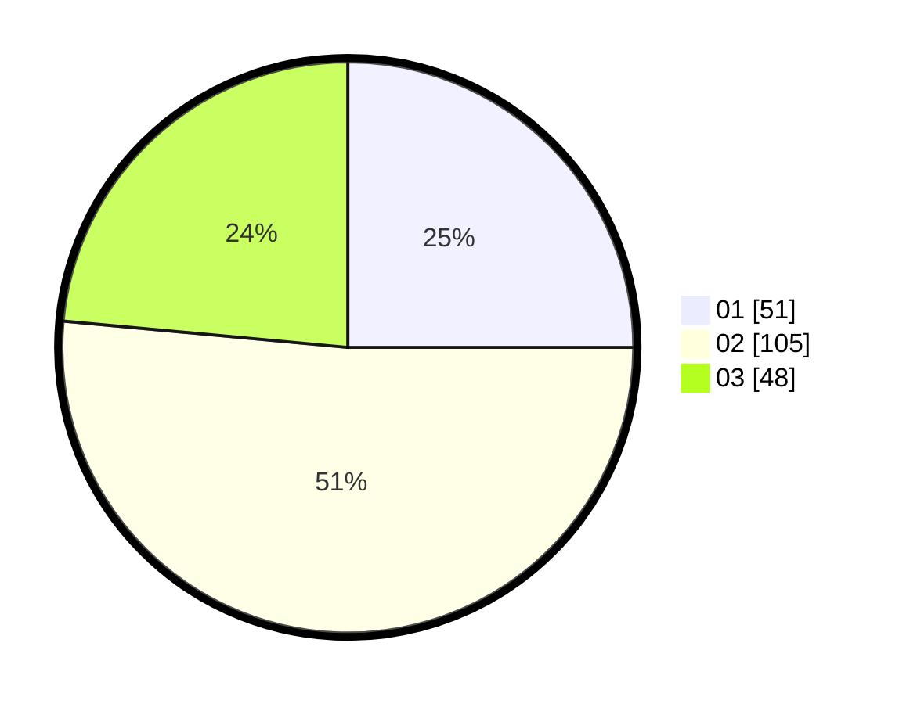

# Hasil

Hasil perolehan suara paslon dapat dilihat pada file paslon-01.txt, paslon-02.txt, dan paslon-03.txt.

Jika tidak ada, artinya data tersebut belum ada pada SIREKAP.

## Perolehan Suara

 * Paslon 01: **51**.
 * Paslon 02: **105**.
 * Paslon 03: **48**.

## Foto C Plano

https://sirekap-obj-formc.kpu.go.id/3c11/pemilu/ppwp/31/73/01/10/01/3173011001136-20240214-224803--29f231a4-edec-462e-8f90-ce1b36a2c9a7.jpg

https://sirekap-obj-formc.kpu.go.id/3c11/pemilu/ppwp/31/73/01/10/01/3173011001136-20240214-224830--ef2e3c75-ae0e-423f-9ee0-3b9893814674.jpg

https://sirekap-obj-formc.kpu.go.id/3c11/pemilu/ppwp/31/73/01/10/01/3173011001136-20240214-224902--a86d3071-830a-4a1e-885f-4347676debb2.jpg
