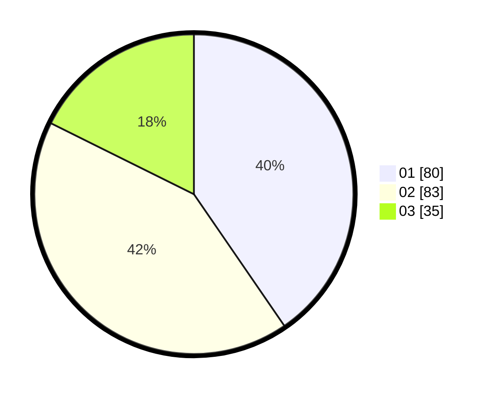

# Hasil

Hasil perolehan suara paslon dapat dilihat pada file paslon-01.txt, paslon-02.txt, dan paslon-03.txt.

Jika tidak ada, artinya data tersebut belum ada pada SIREKAP.

## Perolehan Suara

 * Paslon 01: **80**.
 * Paslon 02: **83**.
 * Paslon 03: **35**.

## Foto C Plano

https://sirekap-obj-formc.kpu.go.id/68ff/pemilu/ppwp/31/73/01/10/01/3173011001138-20240214-221039--735cb735-1ef5-4164-a09b-764361a0aa3d.jpg

https://sirekap-obj-formc.kpu.go.id/68ff/pemilu/ppwp/31/73/01/10/01/3173011001138-20240214-221146--30ba12df-be9b-4100-9528-3157e3f35e3b.jpg

https://sirekap-obj-formc.kpu.go.id/68ff/pemilu/ppwp/31/73/01/10/01/3173011001138-20240214-221323--5b1fb792-04b9-4976-a018-4f57f670a65c.jpg

## DATA PEMILIH TETAP

Jumlah pemilih dalam DPT: **279**.
 * L: **141**.
 * P: **138**.

## DATA PENGGUNA HAK PILIH

Jumlah pengguna hak pilih dalam DPT: **203**.
 * L: **102**.
 * P: **101**.

Jumlah pengguna hak pilih dalam DPTb: **2**.
 * L: **1**.
 * P: **1**.

Jumlah pengguna hak pilih dalam DPK: **0**.
 * L: **0**.
 * P: **0**.

Jumlah pengguna hak pilih: **205**.
 * L: **103**.
 * P: **102**.

## JUMLAH SUARA SAH DAN TIDAK SAH

JUMLAH SELURUH SUARA SAH: **198**.

JUMLAH SUARA TIDAK SAH: **7**.

JUMLAH SELURUH SUARA SAH DAN SUARA TIDAK SAH: **205**.
