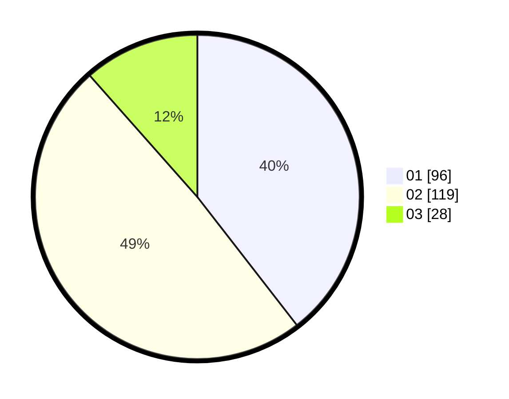

# Hasil

Hasil perolehan suara paslon dapat dilihat pada file paslon-01.txt, paslon-02.txt, dan paslon-03.txt.

Jika tidak ada, artinya data tersebut belum ada pada SIREKAP.

## Perolehan Suara

 * Paslon 01: **96**.
 * Paslon 02: **119**.
 * Paslon 03: **28**.

## Foto C Plano

https://sirekap-obj-formc.kpu.go.id/2d85/pemilu/ppwp/31/73/01/10/01/3173011001140-20240215-012436--86f337df-009e-4884-9191-07cf6c153afb.jpg

https://sirekap-obj-formc.kpu.go.id/2d85/pemilu/ppwp/31/73/01/10/01/3173011001140-20240215-012815--c290949b-b11d-4d1c-b9fb-bdfefe9598fc.jpg

https://sirekap-obj-formc.kpu.go.id/2d85/pemilu/ppwp/31/73/01/10/01/3173011001140-20240215-012909--ca6fefe0-8574-4456-bb84-1250bcf77720.jpg
