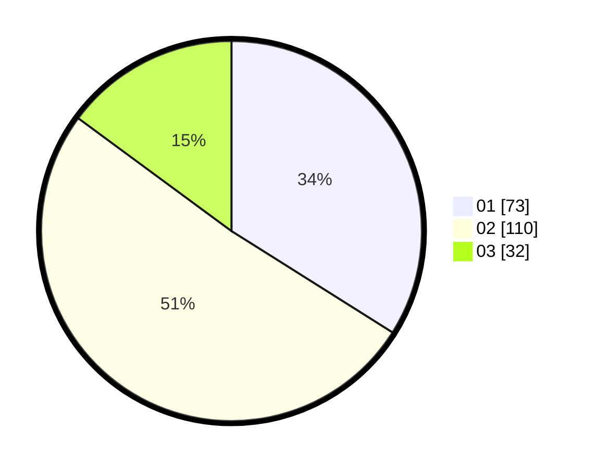

# Hasil

Hasil perolehan suara paslon dapat dilihat pada file paslon-01.txt, paslon-02.txt, dan paslon-03.txt.

Jika tidak ada, artinya data tersebut belum ada pada SIREKAP.

## Perolehan Suara

 * Paslon 01: **73**.
 * Paslon 02: **110**.
 * Paslon 03: **32**.

## Foto C Plano

https://sirekap-obj-formc.kpu.go.id/3a3d/pemilu/ppwp/31/73/01/10/01/3173011001141-20240215-205414--786d2a8d-d2b4-4f9c-a6ae-ac0e516aa8a9.jpg

https://sirekap-obj-formc.kpu.go.id/3a3d/pemilu/ppwp/31/73/01/10/01/3173011001141-20240214-155057--f65aee90-02f9-466c-ae64-cbfa81d4e9b3.jpg

https://sirekap-obj-formc.kpu.go.id/3a3d/pemilu/ppwp/31/73/01/10/01/3173011001141-20240214-155103--13506414-d4a3-4a3e-a88b-5f2bc49ed4c2.jpg

## DATA PEMILIH TETAP

Jumlah pemilih dalam DPT: **217**.
 * L: **108**.
 * P: **109**.

## DATA PENGGUNA HAK PILIH

Jumlah pengguna hak pilih dalam DPT: **215**.
 * L: **108**.
 * P: **107**.

Jumlah pengguna hak pilih dalam DPTb: **1**.
 * L: **0**.
 * P: **1**.

Jumlah pengguna hak pilih dalam DPK: **1**.
 * L: **0**.
 * P: **1**.

Jumlah pengguna hak pilih: **217**.
 * L: **108**.
 * P: **109**.

## JUMLAH SUARA SAH DAN TIDAK SAH

JUMLAH SELURUH SUARA SAH: **215**.

JUMLAH SUARA TIDAK SAH: **2**.

JUMLAH SELURUH SUARA SAH DAN SUARA TIDAK SAH: **217**.
