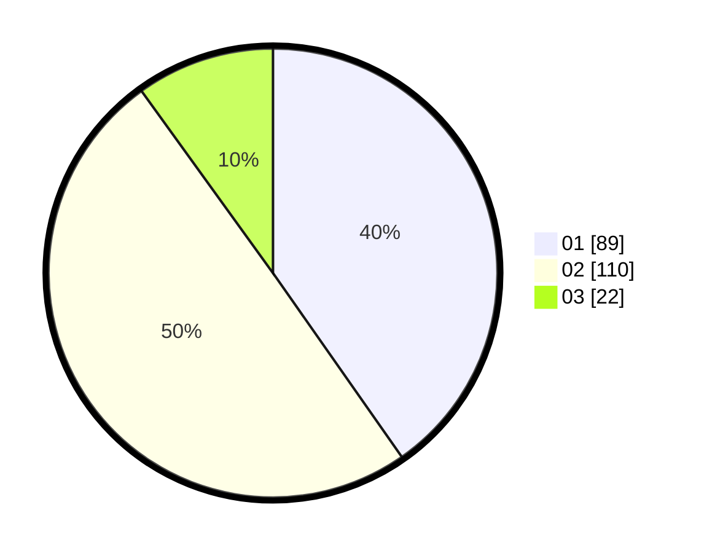

# Hasil

Hasil perolehan suara paslon dapat dilihat pada file paslon-01.txt, paslon-02.txt, dan paslon-03.txt.

Jika tidak ada, artinya data tersebut belum ada pada SIREKAP.

## Perolehan Suara

 * Paslon 01: **89**.
 * Paslon 02: **110**.
 * Paslon 03: **22**.

## Foto C Plano

https://sirekap-obj-formc.kpu.go.id/65d6/pemilu/ppwp/31/73/01/10/01/3173011001142-20240215-011742--5ace9ed7-7f03-479e-86d9-c128a0e65ca6.jpg

https://sirekap-obj-formc.kpu.go.id/65d6/pemilu/ppwp/31/73/01/10/01/3173011001142-20240215-011902--e92ada1a-a524-4b40-b124-86698b6fc677.jpg

https://sirekap-obj-formc.kpu.go.id/65d6/pemilu/ppwp/31/73/01/10/01/3173011001142-20240215-012022--94631393-0ca5-4449-b7a1-44b36403f7c7.jpg
