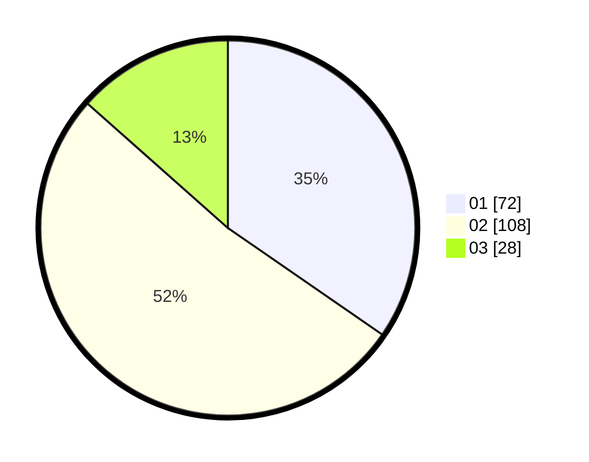

# Hasil

Hasil perolehan suara paslon dapat dilihat pada file paslon-01.txt, paslon-02.txt, dan paslon-03.txt.

Jika tidak ada, artinya data tersebut belum ada pada SIREKAP.

## Perolehan Suara

 * Paslon 01: **72**.
 * Paslon 02: **108**.
 * Paslon 03: **28**.

## Foto C Plano

https://sirekap-obj-formc.kpu.go.id/1322/pemilu/ppwp/31/73/01/10/01/3173011001143-20240215-003550--c12a549b-b453-417c-96ee-23588be41dfa.jpg

https://sirekap-obj-formc.kpu.go.id/1322/pemilu/ppwp/31/73/01/10/01/3173011001143-20240215-003853--7809afbb-be9e-44f9-ad4f-63049b1fcf8d.jpg
