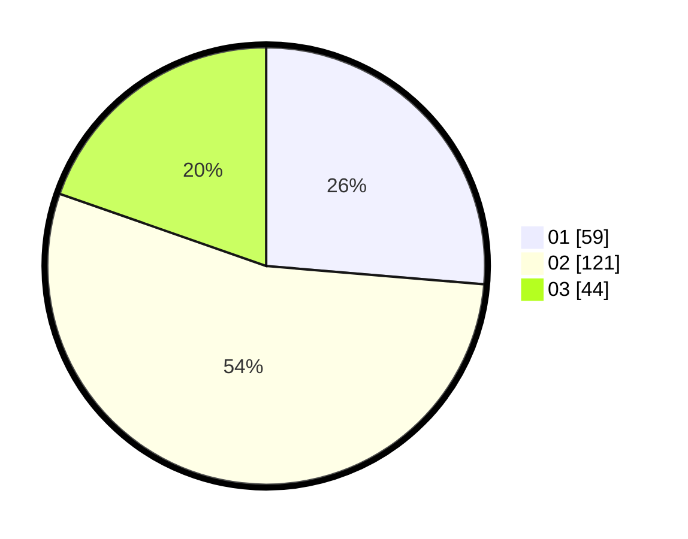

# Hasil

Hasil perolehan suara paslon dapat dilihat pada file paslon-01.txt, paslon-02.txt, dan paslon-03.txt.

Jika tidak ada, artinya data tersebut belum ada pada SIREKAP.

## Perolehan Suara

 * Paslon 01: **59**.
 * Paslon 02: **121**.
 * Paslon 03: **44**.

## Foto C Plano

https://sirekap-obj-formc.kpu.go.id/dcad/pemilu/ppwp/31/73/01/10/01/3173011001145-20240214-222934--e43ba030-9507-4890-9c54-29e417066b75.jpg

https://sirekap-obj-formc.kpu.go.id/dcad/pemilu/ppwp/31/73/01/10/01/3173011001145-20240214-222959--102fe99d-88b1-481e-aab6-fd39c5025876.jpg

https://sirekap-obj-formc.kpu.go.id/dcad/pemilu/ppwp/31/73/01/10/01/3173011001145-20240214-223007--6dd0ef3b-db21-4bed-a4aa-deb9f01a93a6.jpg
