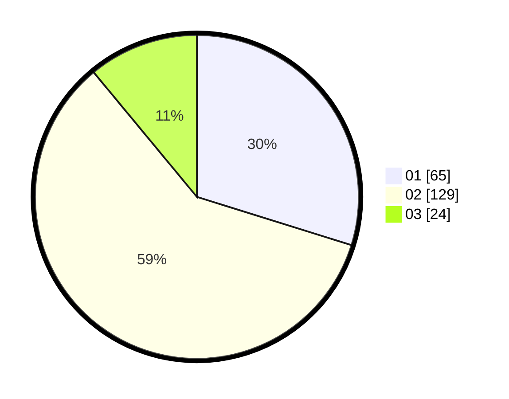

# Hasil

Hasil perolehan suara paslon dapat dilihat pada file paslon-01.txt, paslon-02.txt, dan paslon-03.txt.

Jika tidak ada, artinya data tersebut belum ada pada SIREKAP.

## Perolehan Suara

 * Paslon 01: **65**.
 * Paslon 02: **129**.
 * Paslon 03: **24**.

## Foto C Plano

https://sirekap-obj-formc.kpu.go.id/e624/pemilu/ppwp/31/73/01/10/01/3173011001147-20240214-195109--ebc2e813-cac5-4e17-8d05-f7bf7aae571d.jpg

https://sirekap-obj-formc.kpu.go.id/e624/pemilu/ppwp/31/73/01/10/01/3173011001147-20240214-195141--a6639f9c-301d-4be4-9494-9289459b4742.jpg

https://sirekap-obj-formc.kpu.go.id/e624/pemilu/ppwp/31/73/01/10/01/3173011001147-20240214-201431--1c861d2e-87e2-49a5-9564-00dbb6895975.jpg

## DATA PEMILIH TETAP

Jumlah pemilih dalam DPT: **287**.
 * L: **145**.
 * P: **142**.

## DATA PENGGUNA HAK PILIH

Jumlah pengguna hak pilih dalam DPT: **220**.
 * L: **95**.
 * P: **125**.

Jumlah pengguna hak pilih dalam DPTb: **0**.
 * L: **0**.
 * P: **0**.

Jumlah pengguna hak pilih dalam DPK: **1**.
 * L: **0**.
 * P: **1**.

Jumlah pengguna hak pilih: **221**.
 * L: **95**.
 * P: **126**.

## JUMLAH SUARA SAH DAN TIDAK SAH

JUMLAH SELURUH SUARA SAH: **218**.

JUMLAH SUARA TIDAK SAH: **3**.

JUMLAH SELURUH SUARA SAH DAN SUARA TIDAK SAH: **221**.
