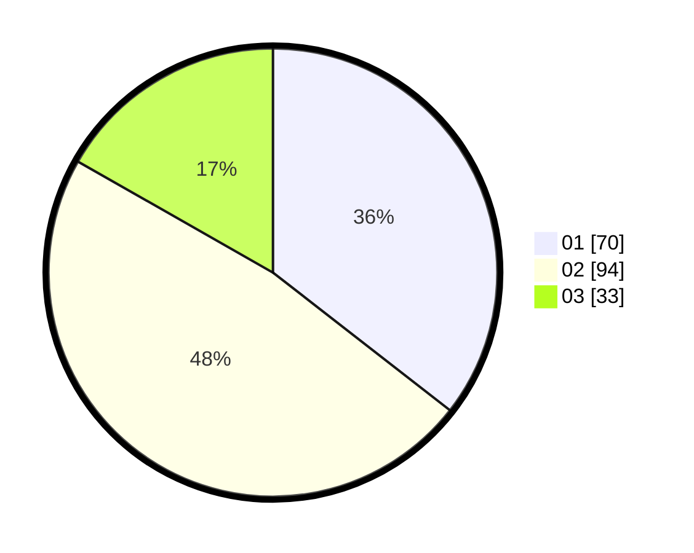

# Hasil

Hasil perolehan suara paslon dapat dilihat pada file paslon-01.txt, paslon-02.txt, dan paslon-03.txt.

Jika tidak ada, artinya data tersebut belum ada pada SIREKAP.

## Perolehan Suara

 * Paslon 01: **70**.
 * Paslon 02: **94**.
 * Paslon 03: **33**.

## Foto C Plano

https://sirekap-obj-formc.kpu.go.id/703b/pemilu/ppwp/31/73/01/10/01/3173011001149-20240214-211900--915390ab-9641-4ef9-996d-aea37cdc531e.jpg

https://sirekap-obj-formc.kpu.go.id/703b/pemilu/ppwp/31/73/01/10/01/3173011001149-20240214-211939--6e562711-11df-48b2-8839-b44ebaafb2cf.jpg

https://sirekap-obj-formc.kpu.go.id/703b/pemilu/ppwp/31/73/01/10/01/3173011001149-20240214-214313--ce6e7558-1291-47a3-92b0-ceab5257bf8e.jpg

## DATA PEMILIH TETAP

Jumlah pemilih dalam DPT: **255**.
 * L: **122**.
 * P: **134**.

## DATA PENGGUNA HAK PILIH

Jumlah pengguna hak pilih dalam DPT: **200**.
 * L: **90**.
 * P: **110**.

Jumlah pengguna hak pilih dalam DPTb: **1**.
 * L: **1**.
 * P: **0**.

Jumlah pengguna hak pilih dalam DPK: **0**.
 * L: **0**.
 * P: **0**.

Jumlah pengguna hak pilih: **201**.
 * L: **91**.
 * P: **110**.

## JUMLAH SUARA SAH DAN TIDAK SAH

JUMLAH SELURUH SUARA SAH: **197**.

JUMLAH SUARA TIDAK SAH: **4**.

JUMLAH SELURUH SUARA SAH DAN SUARA TIDAK SAH: **201**.
