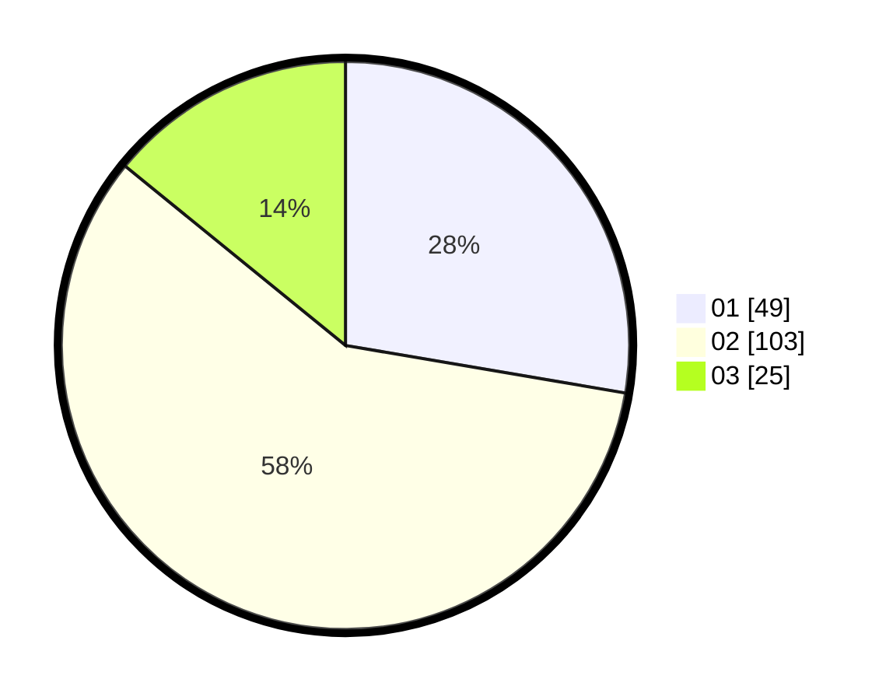

# Hasil

Hasil perolehan suara paslon dapat dilihat pada file paslon-01.txt, paslon-02.txt, dan paslon-03.txt.

Jika tidak ada, artinya data tersebut belum ada pada SIREKAP.

## Perolehan Suara

 * Paslon 01: **49**.
 * Paslon 02: **103**.
 * Paslon 03: **25**.

## Foto C Plano

https://sirekap-obj-formc.kpu.go.id/d750/pemilu/ppwp/31/73/01/10/01/3173011001152-20240214-190346--d45f416f-a12a-47f2-88cf-a5208d029e25.jpg

https://sirekap-obj-formc.kpu.go.id/d750/pemilu/ppwp/31/73/01/10/01/3173011001152-20240214-202116--a5fe7796-3950-485e-9185-18c087ad6e6c.jpg

https://sirekap-obj-formc.kpu.go.id/d750/pemilu/ppwp/31/73/01/10/01/3173011001152-20240214-201712--3a3d7a97-d2a0-465c-a24a-e955665d9109.jpg

## DATA PEMILIH TETAP

Jumlah pemilih dalam DPT: **238**.
 * L: **124**.
 * P: **114**.

## DATA PENGGUNA HAK PILIH

Jumlah pengguna hak pilih dalam DPT: **179**.
 * L: **92**.
 * P: **87**.

Jumlah pengguna hak pilih dalam DPTb: **0**.
 * L: **0**.
 * P: **0**.

Jumlah pengguna hak pilih dalam DPK: **2**.
 * L: **1**.
 * P: **1**.

Jumlah pengguna hak pilih: **181**.
 * L: **93**.
 * P: **88**.

## JUMLAH SUARA SAH DAN TIDAK SAH

JUMLAH SELURUH SUARA SAH: **178**.

JUMLAH SUARA TIDAK SAH: **3**.

JUMLAH SELURUH SUARA SAH DAN SUARA TIDAK SAH: **181**.
