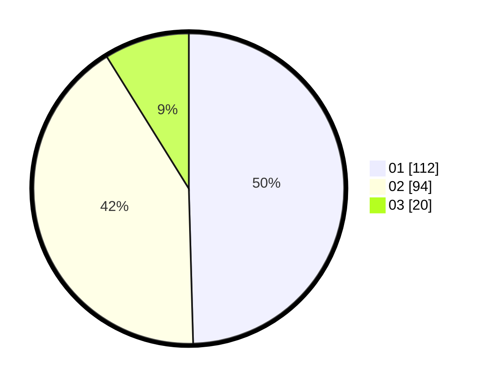

# Hasil

Hasil perolehan suara paslon dapat dilihat pada file paslon-01.txt, paslon-02.txt, dan paslon-03.txt.

Jika tidak ada, artinya data tersebut belum ada pada SIREKAP.

## Perolehan Suara

 * Paslon 01: **112**.
 * Paslon 02: **94**.
 * Paslon 03: **20**.

## Foto C Plano

https://sirekap-obj-formc.kpu.go.id/6227/pemilu/ppwp/31/73/01/10/01/3173011001166-20240215-020453--e02b740e-b68c-4bb4-a545-61f52174f12c.jpg

https://sirekap-obj-formc.kpu.go.id/6227/pemilu/ppwp/31/73/01/10/01/3173011001166-20240215-020656--1eebd313-25d3-424c-ae8e-9c067056d026.jpg
