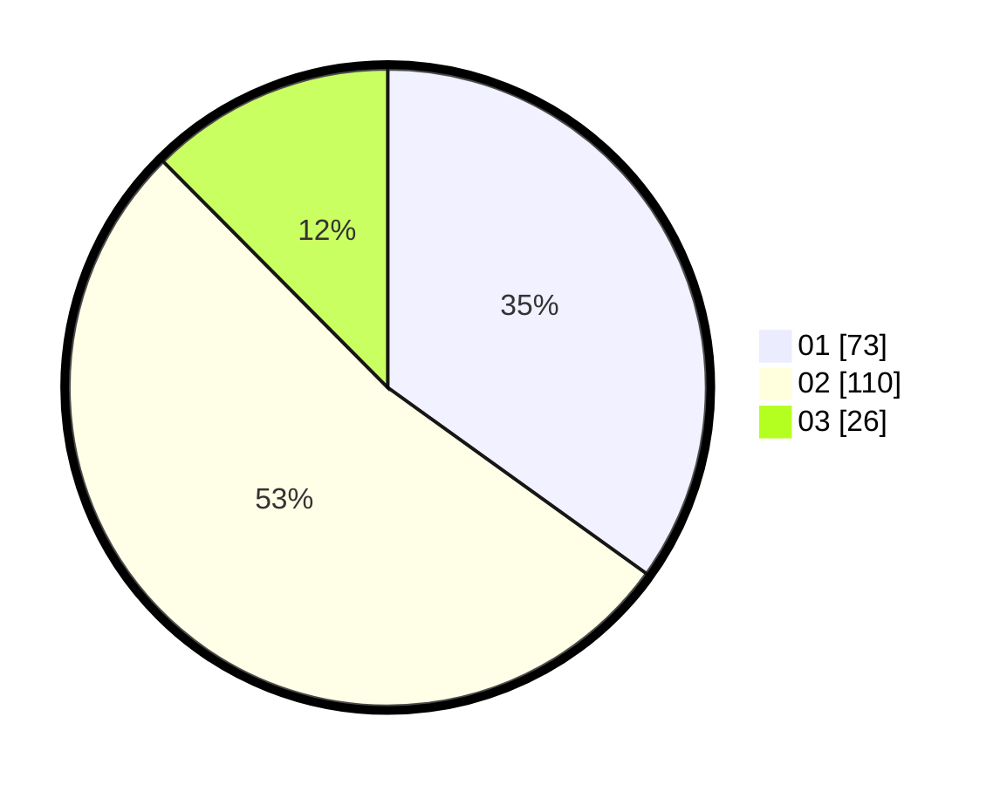

# Hasil

Hasil perolehan suara paslon dapat dilihat pada file paslon-01.txt, paslon-02.txt, dan paslon-03.txt.

Jika tidak ada, artinya data tersebut belum ada pada SIREKAP.

## Perolehan Suara

 * Paslon 01: **73**.
 * Paslon 02: **110**.
 * Paslon 03: **26**.

## Foto C Plano

https://sirekap-obj-formc.kpu.go.id/e1cc/pemilu/ppwp/31/73/01/10/01/3173011001167-20240214-195120--1f5f194e-6611-4e93-a2f3-cfb58587892e.jpg

https://sirekap-obj-formc.kpu.go.id/e1cc/pemilu/ppwp/31/73/01/10/01/3173011001167-20240214-200246--aaa1a982-c625-48b4-b113-bc5b310a3f84.jpg

https://sirekap-obj-formc.kpu.go.id/e1cc/pemilu/ppwp/31/73/01/10/01/3173011001167-20240214-200632--27406101-00e4-4f61-9906-2766d098bf29.jpg

## DATA PEMILIH TETAP

Jumlah pemilih dalam DPT: **281**.
 * L: **138**.
 * P: **143**.

## DATA PENGGUNA HAK PILIH

Jumlah pengguna hak pilih dalam DPT: **210**.
 * L: **109**.
 * P: **101**.

Jumlah pengguna hak pilih dalam DPTb: **0**.
 * L: **0**.
 * P: **0**.

Jumlah pengguna hak pilih dalam DPK: **4**.
 * L: **2**.
 * P: **2**.

Jumlah pengguna hak pilih: **214**.
 * L: **111**.
 * P: **103**.

## JUMLAH SUARA SAH DAN TIDAK SAH

JUMLAH SELURUH SUARA SAH: **209**.

JUMLAH SUARA TIDAK SAH: **5**.

JUMLAH SELURUH SUARA SAH DAN SUARA TIDAK SAH: **214**.
