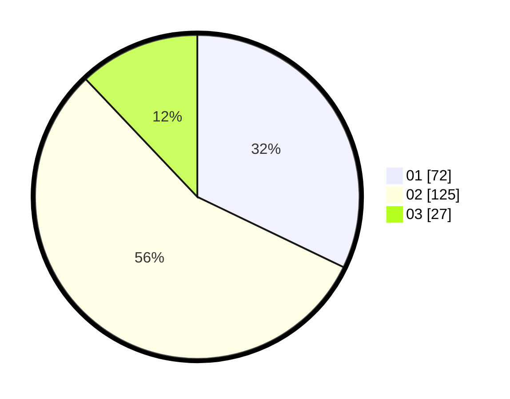

# Hasil

Hasil perolehan suara paslon dapat dilihat pada file paslon-01.txt, paslon-02.txt, dan paslon-03.txt.

Jika tidak ada, artinya data tersebut belum ada pada SIREKAP.

## Perolehan Suara

 * Paslon 01: **72**.
 * Paslon 02: **125**.
 * Paslon 03: **27**.

## Foto C Plano

https://sirekap-obj-formc.kpu.go.id/0dee/pemilu/ppwp/31/73/01/10/01/3173011001171-20240216-223532--399a6a79-9cc2-4e40-8d0a-a45f774e7f00.jpg

https://sirekap-obj-formc.kpu.go.id/0dee/pemilu/ppwp/31/73/01/10/01/3173011001171-20240216-223533--cf8f597d-6fe5-4c51-9334-f7e21f836d21.jpg

https://sirekap-obj-formc.kpu.go.id/0dee/pemilu/ppwp/31/73/01/10/01/3173011001171-20240216-223533--53672e3d-df5c-46ae-b8a9-44ab6874b0f0.jpg

## DATA PEMILIH TETAP

Jumlah pemilih dalam DPT: **284**.
 * L: **133**.
 * P: **151**.

## DATA PENGGUNA HAK PILIH

Jumlah pengguna hak pilih dalam DPT: **226**.
 * L: **99**.
 * P: **127**.

Jumlah pengguna hak pilih dalam DPTb: **2**.
 * L: **1**.
 * P: **1**.

Jumlah pengguna hak pilih dalam DPK: **1**.
 * L: **1**.
 * P: **0**.

Jumlah pengguna hak pilih: **229**.
 * L: **101**.
 * P: **128**.

## JUMLAH SUARA SAH DAN TIDAK SAH

JUMLAH SELURUH SUARA SAH: **224**.

JUMLAH SUARA TIDAK SAH: **5**.

JUMLAH SELURUH SUARA SAH DAN SUARA TIDAK SAH: **229**.
