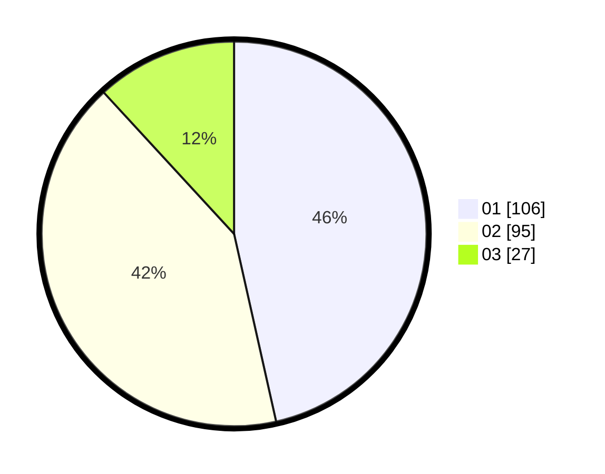

# Hasil

Hasil perolehan suara paslon dapat dilihat pada file paslon-01.txt, paslon-02.txt, dan paslon-03.txt.

Jika tidak ada, artinya data tersebut belum ada pada SIREKAP.

## Perolehan Suara

 * Paslon 01: **106**.
 * Paslon 02: **95**.
 * Paslon 03: **27**.

## Foto C Plano

https://sirekap-obj-formc.kpu.go.id/7122/pemilu/ppwp/31/73/01/10/01/3173011001173-20240214-200532--4c9d4899-b22f-4184-9ded-06a0b14f2223.jpg

https://sirekap-obj-formc.kpu.go.id/7122/pemilu/ppwp/31/73/01/10/01/3173011001173-20240214-200618--025abacd-5d19-4af3-9b02-fc540e919bac.jpg

https://sirekap-obj-formc.kpu.go.id/7122/pemilu/ppwp/31/73/01/10/01/3173011001173-20240214-200659--f6600bc1-6ef2-4fb9-bdb1-d3e36fb30554.jpg

## DATA PEMILIH TETAP

Jumlah pemilih dalam DPT: **285**.
 * L: **131**.
 * P: **154**.

## DATA PENGGUNA HAK PILIH

Jumlah pengguna hak pilih dalam DPT: **229**.
 * L: **111**.
 * P: **118**.

Jumlah pengguna hak pilih dalam DPTb: **0**.
 * L: **0**.
 * P: **0**.

Jumlah pengguna hak pilih dalam DPK: **3**.
 * L: **1**.
 * P: **2**.

Jumlah pengguna hak pilih: **232**.
 * L: **112**.
 * P: **120**.

## JUMLAH SUARA SAH DAN TIDAK SAH

JUMLAH SELURUH SUARA SAH: **228**.

JUMLAH SUARA TIDAK SAH: **4**.

JUMLAH SELURUH SUARA SAH DAN SUARA TIDAK SAH: **232**.
