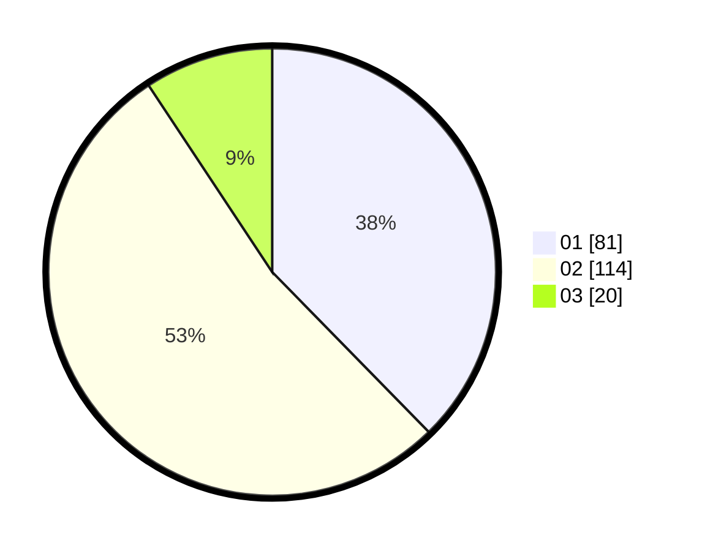

# Hasil

Hasil perolehan suara paslon dapat dilihat pada file paslon-01.txt, paslon-02.txt, dan paslon-03.txt.

Jika tidak ada, artinya data tersebut belum ada pada SIREKAP.

## Perolehan Suara

 * Paslon 01: **81**.
 * Paslon 02: **114**.
 * Paslon 03: **20**.

## Foto C Plano

https://sirekap-obj-formc.kpu.go.id/c902/pemilu/ppwp/31/73/01/10/01/3173011001174-20240215-192520--ff0cd672-c1b4-41e4-b67d-766ee5166583.jpg

https://sirekap-obj-formc.kpu.go.id/c902/pemilu/ppwp/31/73/01/10/01/3173011001174-20240215-192610--08787726-c9c8-4785-8aa1-dd8ff1831250.jpg

https://sirekap-obj-formc.kpu.go.id/c902/pemilu/ppwp/31/73/01/10/01/3173011001174-20240215-192840--9d920a7a-2661-4099-a6c8-e1413c24313a.jpg
