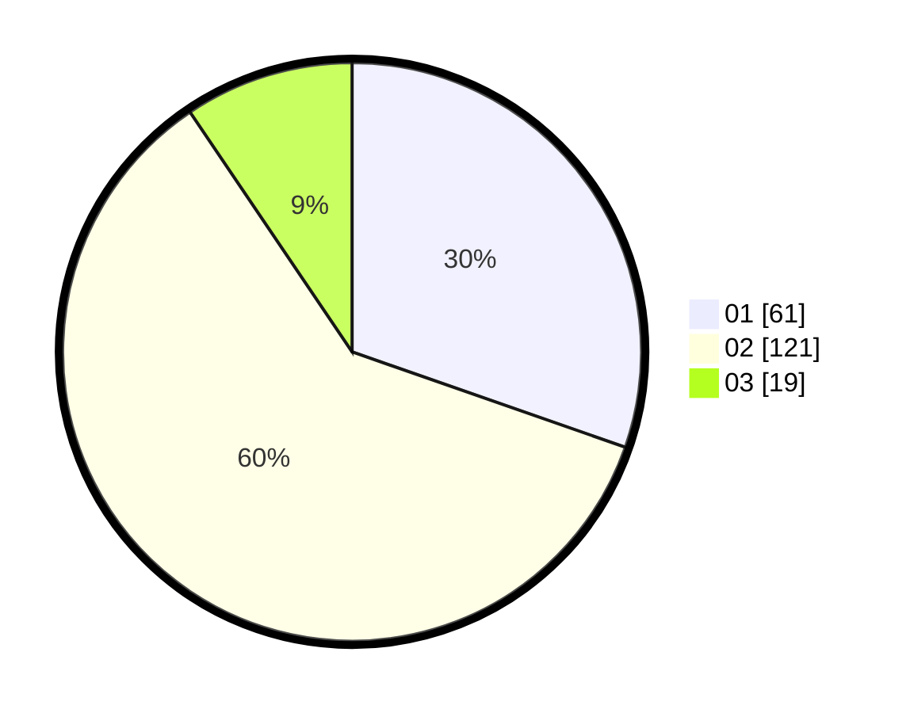

# Hasil

Hasil perolehan suara paslon dapat dilihat pada file paslon-01.txt, paslon-02.txt, dan paslon-03.txt.

Jika tidak ada, artinya data tersebut belum ada pada SIREKAP.

## Perolehan Suara

 * Paslon 01: **61**.
 * Paslon 02: **121**.
 * Paslon 03: **19**.

## Foto C Plano

https://sirekap-obj-formc.kpu.go.id/df93/pemilu/ppwp/31/73/01/10/01/3173011001178-20240215-170132--8bdd6ff3-6382-49d5-b39e-758027144ef6.jpg

https://sirekap-obj-formc.kpu.go.id/df93/pemilu/ppwp/31/73/01/10/01/3173011001178-20240215-170153--00894c00-9f68-4dca-9f5e-93b0a50a0d15.jpg

https://sirekap-obj-formc.kpu.go.id/df93/pemilu/ppwp/31/73/01/10/01/3173011001178-20240215-170142--4a751684-0600-4ecc-aa8d-d579bd47b406.jpg

## DATA PEMILIH TETAP

Jumlah pemilih dalam DPT: **273**.
 * L: **145**.
 * P: **128**.

## DATA PENGGUNA HAK PILIH

Jumlah pengguna hak pilih dalam DPT: **204**.
 * L: **101**.
 * P: **103**.

Jumlah pengguna hak pilih dalam DPTb: **1**.
 * L: **1**.
 * P: **0**.

Jumlah pengguna hak pilih dalam DPK: **2**.
 * L: **1**.
 * P: **1**.

Jumlah pengguna hak pilih: **207**.
 * L: **103**.
 * P: **104**.

## JUMLAH SUARA SAH DAN TIDAK SAH

JUMLAH SELURUH SUARA SAH: **201**.

JUMLAH SUARA TIDAK SAH: **6**.

JUMLAH SELURUH SUARA SAH DAN SUARA TIDAK SAH: **207**.
