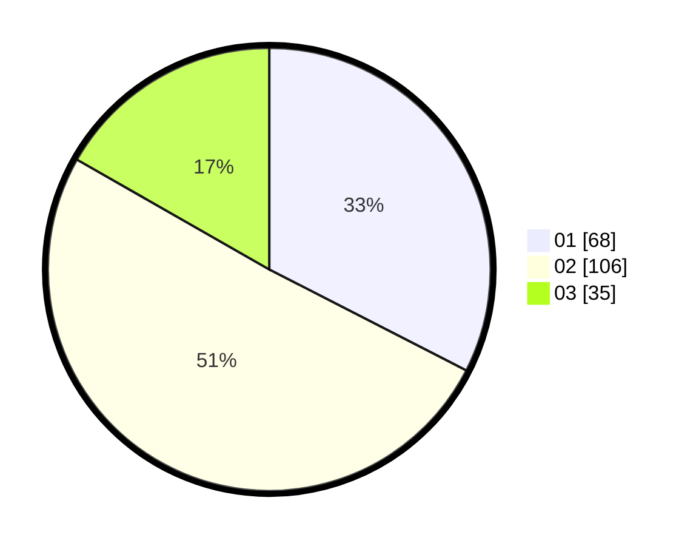

# Hasil

Hasil perolehan suara paslon dapat dilihat pada file paslon-01.txt, paslon-02.txt, dan paslon-03.txt.

Jika tidak ada, artinya data tersebut belum ada pada SIREKAP.

## Perolehan Suara

 * Paslon 01: **68**.
 * Paslon 02: **106**.
 * Paslon 03: **35**.

## Foto C Plano

https://sirekap-obj-formc.kpu.go.id/d3f7/pemilu/ppwp/31/73/01/10/01/3173011001180-20240215-024403--9a7d4a4c-2d10-46b2-add0-0871ff918df0.jpg

https://sirekap-obj-formc.kpu.go.id/d3f7/pemilu/ppwp/31/73/01/10/01/3173011001180-20240215-024512--2335e575-af29-4cd5-87d8-89adb5b6b9bf.jpg

https://sirekap-obj-formc.kpu.go.id/d3f7/pemilu/ppwp/31/73/01/10/01/3173011001180-20240215-024650--87c83237-94b7-4990-b0da-433d65c3680c.jpg
