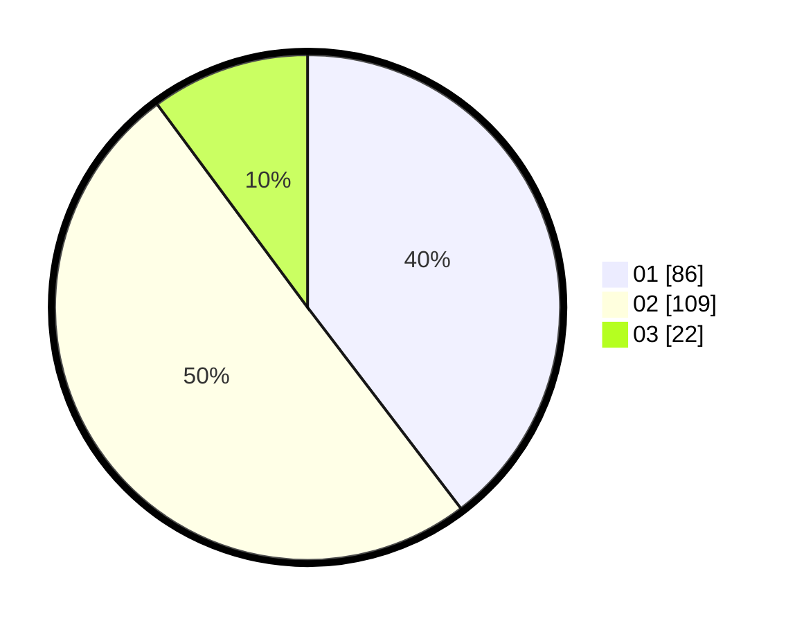

# Hasil

Hasil perolehan suara paslon dapat dilihat pada file paslon-01.txt, paslon-02.txt, dan paslon-03.txt.

Jika tidak ada, artinya data tersebut belum ada pada SIREKAP.

## Perolehan Suara

 * Paslon 01: **86**.
 * Paslon 02: **109**.
 * Paslon 03: **22**.

## Foto C Plano

https://sirekap-obj-formc.kpu.go.id/c91d/pemilu/ppwp/31/73/01/10/01/3173011001181-20240215-064135--9e60a7c3-63e8-4fa3-84bb-dd9984f8ab2c.jpg

https://sirekap-obj-formc.kpu.go.id/c91d/pemilu/ppwp/31/73/01/10/01/3173011001181-20240215-001812--3ff9a0a7-f90d-4dd7-9c64-5b9c3f8f7c80.jpg

https://sirekap-obj-formc.kpu.go.id/c91d/pemilu/ppwp/31/73/01/10/01/3173011001181-20240215-001918--720a0718-ad5b-4e6a-bb34-4d1c73aecd24.jpg
