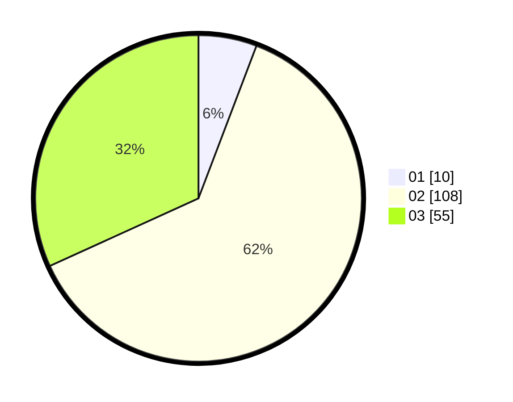

# Hasil

Hasil perolehan suara paslon dapat dilihat pada file paslon-01.txt, paslon-02.txt, dan paslon-03.txt.

Jika tidak ada, artinya data tersebut belum ada pada SIREKAP.

## Perolehan Suara

 * Paslon 01: **10**.
 * Paslon 02: **108**.
 * Paslon 03: **55**.

## Foto C Plano

https://sirekap-obj-formc.kpu.go.id/9248/pemilu/ppwp/31/73/01/10/01/3173011001186-20240215-011500--1726293f-8d79-4c12-8e4c-29a4cbf49dd0.jpg

https://sirekap-obj-formc.kpu.go.id/9248/pemilu/ppwp/31/73/01/10/01/3173011001186-20240215-011642--0267e0ec-0808-4e91-93c8-b53bbd7c0c34.jpg

https://sirekap-obj-formc.kpu.go.id/9248/pemilu/ppwp/31/73/01/10/01/3173011001186-20240215-011811--29ca963c-7c64-46b9-a44b-1095d3e5126d.jpg
