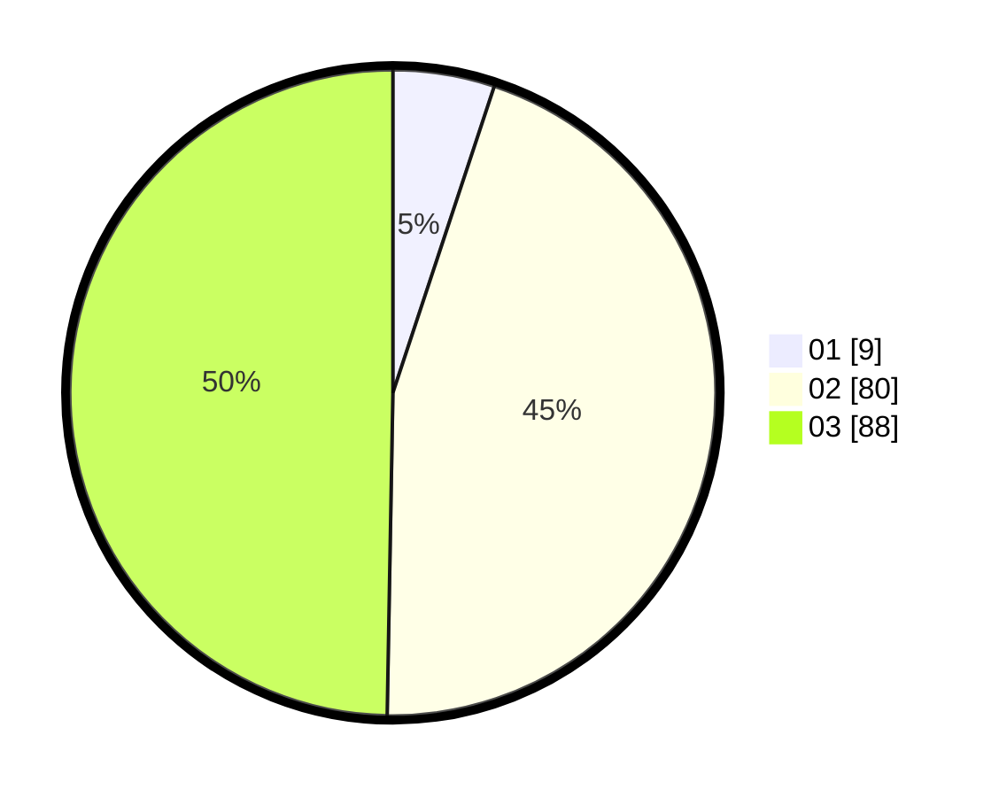

# Hasil

Hasil perolehan suara paslon dapat dilihat pada file paslon-01.txt, paslon-02.txt, dan paslon-03.txt.

Jika tidak ada, artinya data tersebut belum ada pada SIREKAP.

## Perolehan Suara

 * Paslon 01: **9**.
 * Paslon 02: **80**.
 * Paslon 03: **88**.

## Foto C Plano

https://sirekap-obj-formc.kpu.go.id/4eea/pemilu/ppwp/31/73/01/10/01/3173011001187-20240214-214253--91fb9f86-5139-46f4-84b8-da0f2d0b717e.jpg

https://sirekap-obj-formc.kpu.go.id/4eea/pemilu/ppwp/31/73/01/10/01/3173011001187-20240214-214310--f79b301c-080c-4ac2-8944-0cbd1085391f.jpg

https://sirekap-obj-formc.kpu.go.id/4eea/pemilu/ppwp/31/73/01/10/01/3173011001187-20240214-214343--c524f7e0-f667-45e3-96fc-6a753b2130b1.jpg
