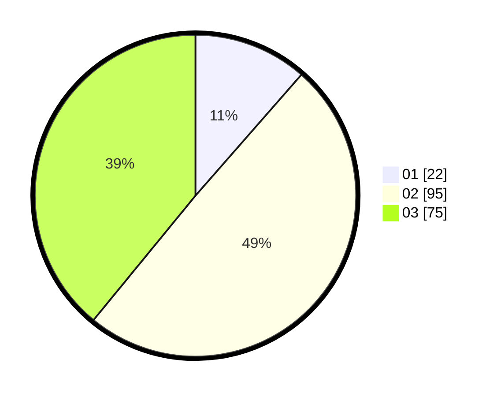

# Hasil

Hasil perolehan suara paslon dapat dilihat pada file paslon-01.txt, paslon-02.txt, dan paslon-03.txt.

Jika tidak ada, artinya data tersebut belum ada pada SIREKAP.

## Perolehan Suara

 * Paslon 01: **22**.
 * Paslon 02: **95**.
 * Paslon 03: **75**.

## Foto C Plano

https://sirekap-obj-formc.kpu.go.id/bb96/pemilu/ppwp/31/73/01/10/01/3173011001188-20240214-192156--a08a3451-debd-4b2c-a8bc-5b440c5120c5.jpg

https://sirekap-obj-formc.kpu.go.id/bb96/pemilu/ppwp/31/73/01/10/01/3173011001188-20240214-192430--cd9eb1a4-52ff-4150-b907-6367d049ffa5.jpg

https://sirekap-obj-formc.kpu.go.id/bb96/pemilu/ppwp/31/73/01/10/01/3173011001188-20240214-192058--15a97efc-0673-449c-9c7e-cc5011b45c1a.jpg
