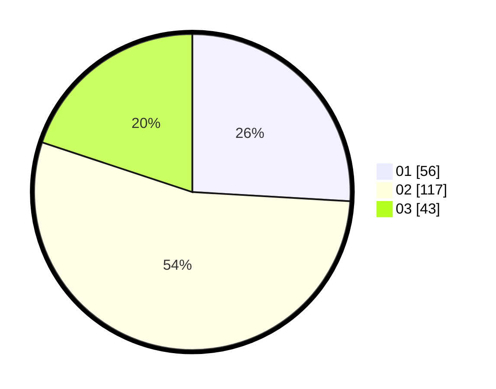

# Hasil

Hasil perolehan suara paslon dapat dilihat pada file paslon-01.txt, paslon-02.txt, dan paslon-03.txt.

Jika tidak ada, artinya data tersebut belum ada pada SIREKAP.

## Perolehan Suara

 * Paslon 01: **56**.
 * Paslon 02: **117**.
 * Paslon 03: **43**.

## Foto C Plano

https://sirekap-obj-formc.kpu.go.id/a4c1/pemilu/ppwp/31/73/01/10/01/3173011001189-20240215-005730--9a880a7b-33e3-481d-ac3c-eb95cdd5a9d0.jpg

https://sirekap-obj-formc.kpu.go.id/a4c1/pemilu/ppwp/31/73/01/10/01/3173011001189-20240215-005823--b60c6f46-54f5-4252-b7ac-8df4af65537e.jpg

https://sirekap-obj-formc.kpu.go.id/a4c1/pemilu/ppwp/31/73/01/10/01/3173011001189-20240215-005850--e5d4e843-082d-457c-9a53-b20b92b84c87.jpg
