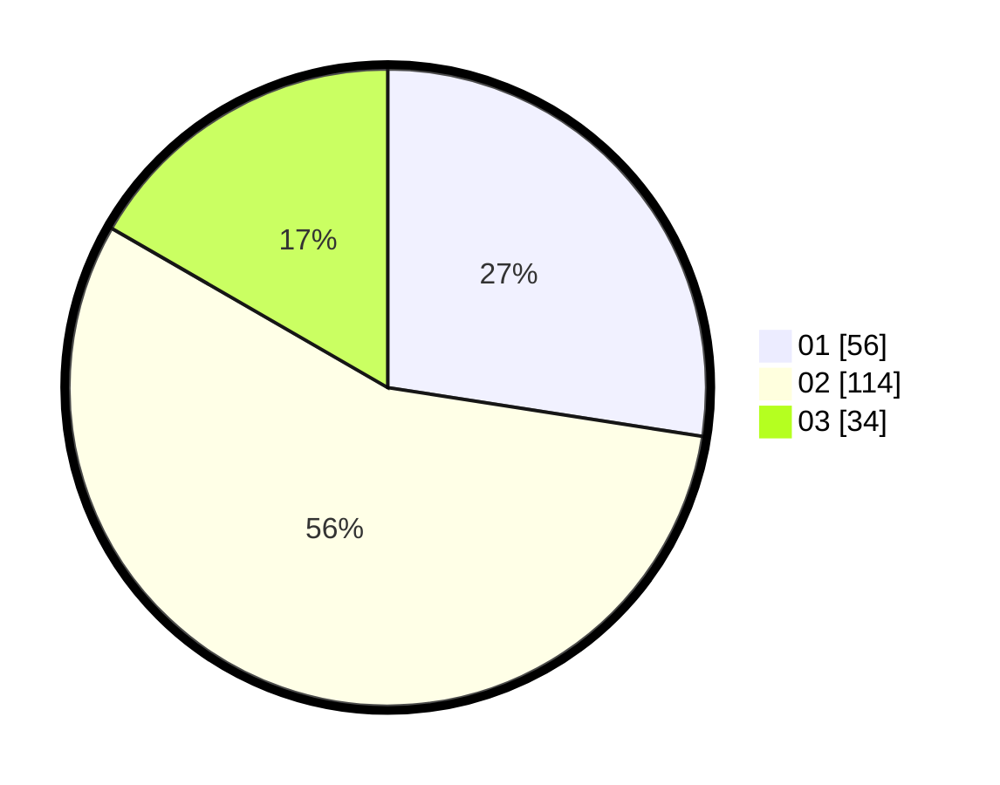

# Hasil

Hasil perolehan suara paslon dapat dilihat pada file paslon-01.txt, paslon-02.txt, dan paslon-03.txt.

Jika tidak ada, artinya data tersebut belum ada pada SIREKAP.

## Perolehan Suara

 * Paslon 01: **56**.
 * Paslon 02: **114**.
 * Paslon 03: **34**.

## Foto C Plano

https://sirekap-obj-formc.kpu.go.id/2844/pemilu/ppwp/31/73/01/10/01/3173011001192-20240214-220535--d59e9e1d-6928-487b-a947-69edf68c9ff4.jpg

https://sirekap-obj-formc.kpu.go.id/2844/pemilu/ppwp/31/73/01/10/01/3173011001192-20240214-220736--3386fe1f-1c30-4712-ba70-7a184eee6a84.jpg

https://sirekap-obj-formc.kpu.go.id/2844/pemilu/ppwp/31/73/01/10/01/3173011001192-20240214-220917--5fd88cc1-482e-478d-8f2e-9d91d8140546.jpg
