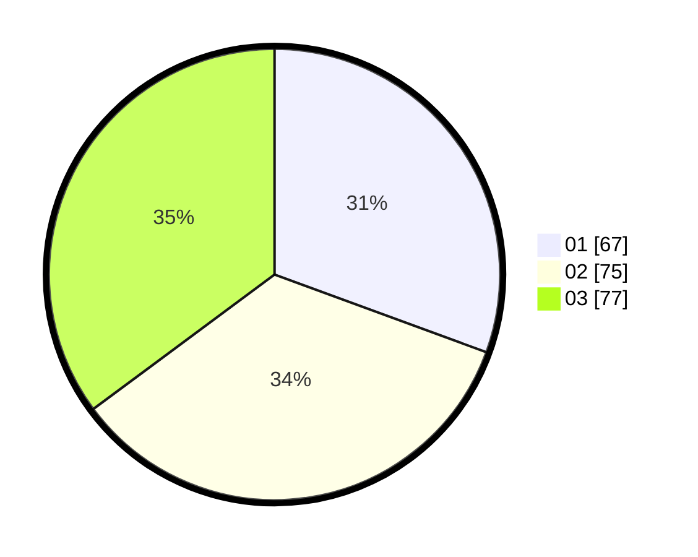

# Hasil

Hasil perolehan suara paslon dapat dilihat pada file paslon-01.txt, paslon-02.txt, dan paslon-03.txt.

Jika tidak ada, artinya data tersebut belum ada pada SIREKAP.

## Perolehan Suara

 * Paslon 01: **67**.
 * Paslon 02: **75**.
 * Paslon 03: **77**.

## Foto C Plano

https://sirekap-obj-formc.kpu.go.id/7e36/pemilu/ppwp/31/73/01/10/01/3173011001193-20240215-004020--e00fecd5-9a7e-44d6-9e85-2a1f6aa7cf18.jpg

https://sirekap-obj-formc.kpu.go.id/7e36/pemilu/ppwp/31/73/01/10/01/3173011001193-20240215-003527--73949ec4-a2e1-4222-84e5-6bc253c129c3.jpg

https://sirekap-obj-formc.kpu.go.id/7e36/pemilu/ppwp/31/73/01/10/01/3173011001193-20240215-003648--46076e06-3937-423b-be3b-c1180d33aead.jpg
